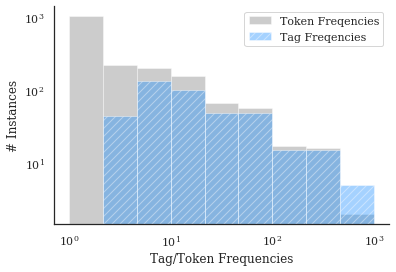
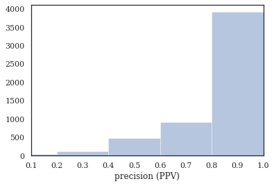
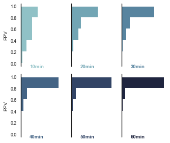
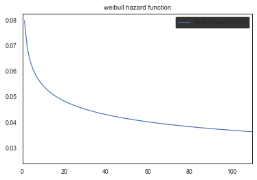
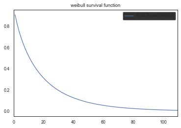
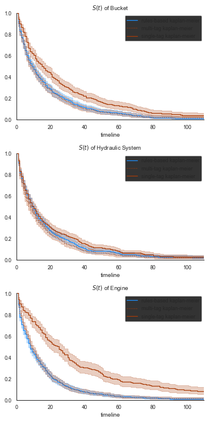
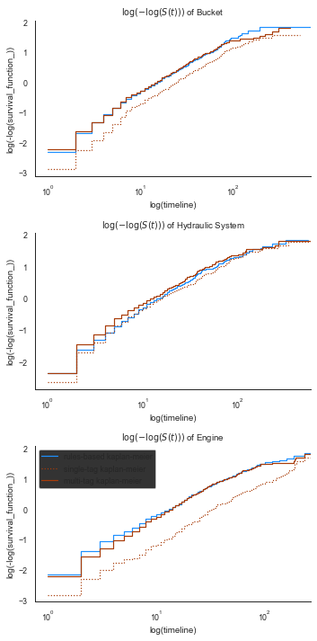

# Survival Analysis

Mining Excavator dataset case study, as originally presented in Sexton et al. [@sexton2018benchmarking].


```python
from pathlib import Path
import numpy as np
import pandas as pd
import seaborn as sns
import matplotlib.pyplot as plt
%matplotlib inline

import nestor
from nestor import keyword as kex
import nestor.datasets as dat
def set_style():
    # This sets reasonable defaults for font size for a figure that will go in a paper
    sns.set_context("paper")
    
    # Set the font to be serif, rather than sans
    sns.set(font='serif')
    
    # Make the background white, and specify the specific font family
    sns.set_style("white", {
        "font.family": "serif",
        "font.serif": ["Times", "Palatino", "serif"]
    })
set_style()
```


```python
df = dat.load_excavators()
df.head().style
```


<style  type="text/css" >
</style><table id="T_db70b24e_28b2_11ea_9947_6045cb9bc3c7" ><thead>    <tr>        <th class="blank level0" ></th>        <th class="col_heading level0 col0" >BscStartDate</th>        <th class="col_heading level0 col1" >Asset</th>        <th class="col_heading level0 col2" >OriginalShorttext</th>        <th class="col_heading level0 col3" >PMType</th>        <th class="col_heading level0 col4" >Cost</th>    </tr></thead><tbody>
                <tr>
                        <th id="T_db70b24e_28b2_11ea_9947_6045cb9bc3c7level0_row0" class="row_heading level0 row0" >0</th>
                        <td id="T_db70b24e_28b2_11ea_9947_6045cb9bc3c7row0_col0" class="data row0 col0" >2004-07-01 00:00:00</td>
                        <td id="T_db70b24e_28b2_11ea_9947_6045cb9bc3c7row0_col1" class="data row0 col1" >A</td>
                        <td id="T_db70b24e_28b2_11ea_9947_6045cb9bc3c7row0_col2" class="data row0 col2" >BUCKET WON'T OPEN</td>
                        <td id="T_db70b24e_28b2_11ea_9947_6045cb9bc3c7row0_col3" class="data row0 col3" >PM01</td>
                        <td id="T_db70b24e_28b2_11ea_9947_6045cb9bc3c7row0_col4" class="data row0 col4" >183.05</td>
            </tr>
            <tr>
                        <th id="T_db70b24e_28b2_11ea_9947_6045cb9bc3c7level0_row1" class="row_heading level0 row1" >1</th>
                        <td id="T_db70b24e_28b2_11ea_9947_6045cb9bc3c7row1_col0" class="data row1 col0" >2005-03-20 00:00:00</td>
                        <td id="T_db70b24e_28b2_11ea_9947_6045cb9bc3c7row1_col1" class="data row1 col1" >A</td>
                        <td id="T_db70b24e_28b2_11ea_9947_6045cb9bc3c7row1_col2" class="data row1 col2" >L/H BUCKET CYL LEAKING.</td>
                        <td id="T_db70b24e_28b2_11ea_9947_6045cb9bc3c7row1_col3" class="data row1 col3" >PM01</td>
                        <td id="T_db70b24e_28b2_11ea_9947_6045cb9bc3c7row1_col4" class="data row1 col4" >407.4</td>
            </tr>
            <tr>
                        <th id="T_db70b24e_28b2_11ea_9947_6045cb9bc3c7level0_row2" class="row_heading level0 row2" >2</th>
                        <td id="T_db70b24e_28b2_11ea_9947_6045cb9bc3c7row2_col0" class="data row2 col0" >2006-05-05 00:00:00</td>
                        <td id="T_db70b24e_28b2_11ea_9947_6045cb9bc3c7row2_col1" class="data row2 col1" >A</td>
                        <td id="T_db70b24e_28b2_11ea_9947_6045cb9bc3c7row2_col2" class="data row2 col2" >SWAP BUCKET</td>
                        <td id="T_db70b24e_28b2_11ea_9947_6045cb9bc3c7row2_col3" class="data row2 col3" >PM01</td>
                        <td id="T_db70b24e_28b2_11ea_9947_6045cb9bc3c7row2_col4" class="data row2 col4" >0</td>
            </tr>
            <tr>
                        <th id="T_db70b24e_28b2_11ea_9947_6045cb9bc3c7level0_row3" class="row_heading level0 row3" >3</th>
                        <td id="T_db70b24e_28b2_11ea_9947_6045cb9bc3c7row3_col0" class="data row3 col0" >2006-07-11 00:00:00</td>
                        <td id="T_db70b24e_28b2_11ea_9947_6045cb9bc3c7row3_col1" class="data row3 col1" >A</td>
                        <td id="T_db70b24e_28b2_11ea_9947_6045cb9bc3c7row3_col2" class="data row3 col2" >FIT BUCKET TOOTH</td>
                        <td id="T_db70b24e_28b2_11ea_9947_6045cb9bc3c7row3_col3" class="data row3 col3" >PM01</td>
                        <td id="T_db70b24e_28b2_11ea_9947_6045cb9bc3c7row3_col4" class="data row3 col4" >0</td>
            </tr>
            <tr>
                        <th id="T_db70b24e_28b2_11ea_9947_6045cb9bc3c7level0_row4" class="row_heading level0 row4" >4</th>
                        <td id="T_db70b24e_28b2_11ea_9947_6045cb9bc3c7row4_col0" class="data row4 col0" >2006-11-10 00:00:00</td>
                        <td id="T_db70b24e_28b2_11ea_9947_6045cb9bc3c7row4_col1" class="data row4 col1" >A</td>
                        <td id="T_db70b24e_28b2_11ea_9947_6045cb9bc3c7row4_col2" class="data row4 col2" >REFIT BUCKET TOOTH</td>
                        <td id="T_db70b24e_28b2_11ea_9947_6045cb9bc3c7row4_col3" class="data row4 col3" >PM01</td>
                        <td id="T_db70b24e_28b2_11ea_9947_6045cb9bc3c7row4_col4" class="data row4 col4" >1157.27</td>
            </tr>
    </tbody></table>


## Knowledge Extraction

### Import vocabulary from tagging tool


```python
# merge and cleanse NLP-containing columns of the data
nlp_select = kex.NLPSelect(columns = ['OriginalShorttext'])
raw_text = nlp_select.transform(df)
```


```python
tex = kex.TokenExtractor()
toks = tex.fit_transform(raw_text)

#Import vocabulary
vocab_path = Path('.')/'support'/'mine_vocab_1g.csv'
vocab = kex.generate_vocabulary_df(tex, init=vocab_path)
tag_df = kex.tag_extractor(tex, raw_text, vocab_df=vocab)

relation_df = tag_df.loc[:, ['P I', 'S I']]
tags_read = kex._get_readable_tag_df(tag_df)
tag_df = tag_df.loc[:, ['I', 'P', 'S', 'U', 'X', 'NA']]    
```


    HBox(children=(IntProgress(value=0, max=6), HTML(value='')))


    


### Quality of Extracted Keywords


```python
nbins = int(np.percentile(tag_df.sum(axis=1), 90))
print(f'Docs have at most {nbins} tokens (90th percentile)')

```

    Docs have at most 5 tokens (90th percentile)


```python
tags_read.join(df[['OriginalShorttext']]).sample(10)
```


<div>
<style scoped>
    .dataframe tbody tr th:only-of-type {
        vertical-align: middle;
    }

    .dataframe tbody tr th {
        vertical-align: top;
    }

    .dataframe thead th {
        text-align: right;
    }
</style>
<table border="1" class="dataframe">
  <thead>
    <tr style="text-align: right;">
      <th></th>
      <th>I</th>
      <th>NA</th>
      <th>P</th>
      <th>S</th>
      <th>U</th>
      <th>X</th>
      <th>OriginalShorttext</th>
    </tr>
  </thead>
  <tbody>
    <tr>
      <th>632</th>
      <td>engine</td>
      <td></td>
      <td>overheating</td>
      <td></td>
      <td></td>
      <td></td>
      <td>ENGINE OVERHEATING</td>
    </tr>
    <tr>
      <th>631</th>
      <td>engine, oil, pressure, right_hand</td>
      <td></td>
      <td>alarm</td>
      <td></td>
      <td>low</td>
      <td></td>
      <td>LOW RH ENGINE OIL PRESSURE ALARM</td>
    </tr>
    <tr>
      <th>4661</th>
      <td>wiper</td>
      <td></td>
      <td>emergency</td>
      <td>repair</td>
      <td></td>
      <td></td>
      <td>Repair Wiper - tied back with a rag.EMER</td>
    </tr>
    <tr>
      <th>1831</th>
      <td>oil, track</td>
      <td></td>
      <td>leak</td>
      <td></td>
      <td>adjuster</td>
      <td></td>
      <td>oil leak on track adjuster</td>
    </tr>
    <tr>
      <th>3087</th>
      <td>grease</td>
      <td></td>
      <td>problem</td>
      <td></td>
      <td></td>
      <td></td>
      <td>grease fill problems</td>
    </tr>
    <tr>
      <th>4870</th>
      <td>frame, plate, safety, track</td>
      <td></td>
      <td></td>
      <td>install</td>
      <td></td>
      <td></td>
      <td>INSTALL TRACK FRAME SAFETY I.D. PLATE</td>
    </tr>
    <tr>
      <th>3945</th>
      <td>boom, oil</td>
      <td></td>
      <td>leak</td>
      <td>repair</td>
      <td></td>
      <td></td>
      <td>REPAIR OIL LEAK UP BOOM</td>
    </tr>
    <tr>
      <th>158</th>
      <td>assy, bucket</td>
      <td></td>
      <td></td>
      <td>changeout</td>
      <td></td>
      <td></td>
      <td>CHANGEOUT ~ BUCKET ASSEMBLY</td>
    </tr>
    <tr>
      <th>366</th>
      <td>bucket, rock, shd, tooth</td>
      <td></td>
      <td></td>
      <td>changeout</td>
      <td></td>
      <td></td>
      <td>Change bucket teeth on SHD24 rock bucket</td>
    </tr>
    <tr>
      <th>1634</th>
      <td>filter, hose</td>
      <td></td>
      <td>restriction</td>
      <td>replace</td>
      <td></td>
      <td></td>
      <td>Replace filter restriction hose</td>
    </tr>
  </tbody>
</table>
</div>


```python
# how many instances of each keyword class are there?
print('named entities: ')
print('I\tItem\nP\tProblem\nS\tSolution')
print('U\tUnknown\nX\tStop Word')
print('total tokens: ', vocab.NE.notna().sum())
print('total tags: ', vocab.groupby("NE").nunique().alias.sum())
vocab.groupby("NE").nunique()
```

    named entities: 
    I	Item
    P	Problem
    S	Solution
    U	Unknown
    X	Stop Word
    total tokens:  1767
    total tags:  492


<div>
<style scoped>
    .dataframe tbody tr th:only-of-type {
        vertical-align: middle;
    }

    .dataframe tbody tr th {
        vertical-align: top;
    }

    .dataframe thead th {
        text-align: right;
    }
</style>
<table border="1" class="dataframe">
  <thead>
    <tr style="text-align: right;">
      <th></th>
      <th>NE</th>
      <th>alias</th>
      <th>notes</th>
      <th>score</th>
    </tr>
    <tr>
      <th>NE</th>
      <th></th>
      <th></th>
      <th></th>
      <th></th>
    </tr>
  </thead>
  <tbody>
    <tr>
      <th></th>
      <td>1</td>
      <td>3</td>
      <td>2</td>
      <td>766</td>
    </tr>
    <tr>
      <th>I</th>
      <td>1</td>
      <td>317</td>
      <td>19</td>
      <td>585</td>
    </tr>
    <tr>
      <th>P</th>
      <td>1</td>
      <td>53</td>
      <td>6</td>
      <td>119</td>
    </tr>
    <tr>
      <th>S</th>
      <td>1</td>
      <td>42</td>
      <td>2</td>
      <td>95</td>
    </tr>
    <tr>
      <th>U</th>
      <td>1</td>
      <td>68</td>
      <td>57</td>
      <td>92</td>
    </tr>
    <tr>
      <th>X</th>
      <td>1</td>
      <td>9</td>
      <td>1</td>
      <td>9</td>
    </tr>
  </tbody>
</table>
</div>


### Effectiveness of Tags

The entire goal, in some sense, is for us to remove low-occurence, unimportant information from our data, and form concept conglomerates that allow more useful statistical inferences to be made. Tags from `nestor-gui`, as the next plot shows, have no instances of 1x-occurrence concepts, compared to several thousand in the raw-tokens (this is by design, of course). Additionally, high occurence concepts that might have had misspellings or synonyms drastically inprove their average occurence rate. 


```python

cts = (tex._model.transform(raw_text)>0.).astype(int).toarray().sum(axis=0)
# cts2 = (tex3._model.transform(replaced_text2)>0.).astype(int).toarray().sum(axis=0)

sns.distplot(cts,
#              np.concatenate((cts, cts2)), 
             bins=np.logspace(0,3,10),
#              bins=np.linspace(0,1500,10),
             norm_hist=False, 
             kde=False, 
             label='Token Freqencies',
             hist_kws={'color':'grey'})
# cts
sns.distplot(tag_df[['I', 'P', 'S']].sum(), 
             bins=np.logspace(0,3,10),
#              bins=np.linspace(0,1500,10),
             norm_hist=False, 
             kde=False, 
             label='Tag Freqencies', 
             hist_kws={'hatch':'///', 'color':'dodgerblue'})

plt.yscale('log')
plt.xscale('log')
tag_df.sum().shape, cts.shape
plt.legend()
plt.xlabel('Tag/Token Frequencies')
plt.ylabel('# Instances')
sns.despine()
# plt.savefig('toks_v_tags.png', dpi=300)
```



    


```python
# tag-completeness of work-orders?
tag_pct, tag_comp, tag_empt = kex.get_tag_completeness(tag_df)

# with sns.axes_style('ticks') as style:
sns.distplot(tag_pct.dropna(), 
             kde=False, bins=nbins, 
             kde_kws={'cut':0})
plt.xlim(0.1, 1.0)
plt.xlabel('precision (PPV)')

```

    Tag completeness: 0.87 +/- 0.20
    Complete Docs: 4444, or 81.02%
    Empty Docs: 48, or 0.88%


    Text(0.5, 0, 'precision (PPV)')


    

    


### Convergence over time, using `nestor-gui`

As part of the comparison study, an expert used `nestor-gui` for approximately 60min annotating 1-grams, followed by 20min focusing on 2-grams. Work was saved every 10 min, so we would like to see how the above plot was arrived at *as the tokens were classified*. 


```python
study_fname = Path('.')/'support'/'vocab_study_results.csv'
study_df = pd.read_csv(study_fname, index_col=0)
study_long = pd.melt(study_df, var_name="time", value_name='PPV').dropna()
study_long['time_val'] = study_long.time.str.replace('min','').astype(float)

sns.set(style="white", rc={"axes.facecolor": (0, 0, 0, 0)}, context='paper')
pal = sns.cubehelix_palette(6, rot=-.25, light=.7)
g = sns.FacetGrid(study_long, col="time", hue="time", aspect=.8, height=2, palette=pal, col_wrap=3)
g.map(sns.distplot, "PPV", kde=False, bins=nbins, vertical=True, 
      hist_kws=dict(alpha=1., histtype='stepfilled', edgecolor='w', lw=2))
g.map(plt.axvline, x=0, lw=1.4, clip_on=False, color='k')

# Define and use a simple function to label the plot in axes coordinates
def label(x, color, label):
    ax = plt.gca()
    ax.text(.2, 0, label, fontweight="bold", color=color,
            ha="left", va="center", transform=ax.transAxes)
g.map(label, "PPV")

# Remove axes details that don't play well with overlap
g.set_titles("")
g.set( xticks=[], xlabel='')
g.set_axis_labels(y_var='PPV')
g.despine(bottom=True, left=True)
plt.tight_layout()
```



    


## Survival Analysis

### Rules-Based
From Hodkeiwiz et al, a rule-based method was used to estimate failure times for SA. Let's see their data: 


```python

df_clean = dat.load_excavators(cleaned=True)

df_clean['SuspSugg'] = pd.to_numeric(df_clean['SuspSugg'], errors='coerce')
df_clean.dropna(subset=['RunningTime', 'SuspSugg'], inplace=True)

df_clean.shape
```


    (5288, 17)


```python
df_clean.sort_values('BscStartDate').head(10)
```


<div>
<style scoped>
    .dataframe tbody tr th:only-of-type {
        vertical-align: middle;
    }

    .dataframe tbody tr th {
        vertical-align: top;
    }

    .dataframe thead th {
        text-align: right;
    }
</style>
<table border="1" class="dataframe">
  <thead>
    <tr style="text-align: right;">
      <th></th>
      <th>BscStartDate</th>
      <th>Asset</th>
      <th>OriginalShorttext</th>
      <th>PMType</th>
      <th>Cost</th>
      <th>RunningTime</th>
      <th>MajorSystem</th>
      <th>Part</th>
      <th>Action</th>
      <th>Variant</th>
      <th>FM</th>
      <th>Location</th>
      <th>Comments</th>
      <th>FuncLocation</th>
      <th>SuspSugg</th>
      <th>Rule</th>
      <th>Unnamed: 16</th>
    </tr>
  </thead>
  <tbody>
    <tr>
      <th>8</th>
      <td>2001-07-19</td>
      <td>B</td>
      <td>REPLACE LIP</td>
      <td>PM01</td>
      <td>1251.52</td>
      <td>7.0</td>
      <td>Bucket</td>
      <td>NaN</td>
      <td>Replace</td>
      <td>2V</td>
      <td>NaN</td>
      <td>NaN</td>
      <td>NaN</td>
      <td>Bucket</td>
      <td>0.0</td>
      <td>Rule_1_3_78_383_384</td>
      <td>NaN</td>
    </tr>
    <tr>
      <th>1820</th>
      <td>2001-09-01</td>
      <td>B</td>
      <td>OIL LEAK L/H TRACK TENSIONER.</td>
      <td>PM01</td>
      <td>0.00</td>
      <td>3.0</td>
      <td>Hydraulic System</td>
      <td>Track</td>
      <td>Minor Maint</td>
      <td>18</td>
      <td>Leak</td>
      <td>Left</td>
      <td>NaN</td>
      <td>Power Train - Transmission</td>
      <td>0.0</td>
      <td>Rule_1_3_52_289_347_425_500</td>
      <td>NaN</td>
    </tr>
    <tr>
      <th>1821</th>
      <td>2001-09-04</td>
      <td>B</td>
      <td>BAD SOS METAL IN OIL</td>
      <td>PM01</td>
      <td>0.00</td>
      <td>3.0</td>
      <td>Hydraulic System</td>
      <td>Slew Gearbox</td>
      <td>NaN</td>
      <td>NaN</td>
      <td>Contamination</td>
      <td>NaN</td>
      <td>NaN</td>
      <td>Sprocket/Drive Compartment Right</td>
      <td>0.0</td>
      <td>Rule_1_3_52_303_409</td>
      <td>NaN</td>
    </tr>
    <tr>
      <th>5253</th>
      <td>2001-09-05</td>
      <td>B</td>
      <td>REPLACE AIRCONDITIONER BELTS</td>
      <td>PM01</td>
      <td>0.00</td>
      <td>23.0</td>
      <td>NaN</td>
      <td>Air Conditioning</td>
      <td>Replace</td>
      <td>2V</td>
      <td>NaN</td>
      <td>NaN</td>
      <td>NaN</td>
      <td>Air Conditioning System</td>
      <td>0.0</td>
      <td>Rule_1_3_224_227_383_384</td>
      <td>NaN</td>
    </tr>
    <tr>
      <th>3701</th>
      <td>2001-09-05</td>
      <td>B</td>
      <td>REPLACE CLAMPS ON CLAM PIPES</td>
      <td>PM01</td>
      <td>0.00</td>
      <td>28.0</td>
      <td>NaN</td>
      <td>Mount</td>
      <td>Replace</td>
      <td>2V</td>
      <td>NaN</td>
      <td>NaN</td>
      <td>NaN</td>
      <td>Oil - Hydraulic</td>
      <td>0.0</td>
      <td>Rule_1_3_92_181_383_384</td>
      <td>NaN</td>
    </tr>
    <tr>
      <th>1167</th>
      <td>2001-09-05</td>
      <td>B</td>
      <td>REPLACE RHS FAN BELT TENSIONER PULLEY</td>
      <td>PM01</td>
      <td>82.09</td>
      <td>0.0</td>
      <td>NaN</td>
      <td>Fan</td>
      <td>Minor Maint_Replace</td>
      <td>2V</td>
      <td>NaN</td>
      <td>Right</td>
      <td>NaN</td>
      <td>+Cooling System</td>
      <td>0.0</td>
      <td>Rule_1_3_125_347_383_384_509</td>
      <td>NaN</td>
    </tr>
    <tr>
      <th>1168</th>
      <td>2001-09-11</td>
      <td>B</td>
      <td>replace fan belt</td>
      <td>PM01</td>
      <td>0.00</td>
      <td>6.0</td>
      <td>NaN</td>
      <td>Fan</td>
      <td>Replace</td>
      <td>2V</td>
      <td>NaN</td>
      <td>NaN</td>
      <td>NaN</td>
      <td>+Cooling System</td>
      <td>0.0</td>
      <td>Rule_1_3_125_383_384</td>
      <td>NaN</td>
    </tr>
    <tr>
      <th>644</th>
      <td>2001-09-15</td>
      <td>B</td>
      <td>replace heads on lhs eng</td>
      <td>PM01</td>
      <td>0.00</td>
      <td>33.0</td>
      <td>Engine</td>
      <td>NaN</td>
      <td>Replace</td>
      <td>2V</td>
      <td>NaN</td>
      <td>Left</td>
      <td>NaN</td>
      <td>Engine Left Cylinder Heads</td>
      <td>0.0</td>
      <td>Rule_1_3_25_383_384_499</td>
      <td>NaN</td>
    </tr>
    <tr>
      <th>4583</th>
      <td>2001-09-26</td>
      <td>B</td>
      <td>REPAIR CABIN DOOR FALLING OFF.</td>
      <td>PM01</td>
      <td>0.00</td>
      <td>27.0</td>
      <td>NaN</td>
      <td>Drivers Cabin</td>
      <td>Repair</td>
      <td>1</td>
      <td>NaN</td>
      <td>NaN</td>
      <td>NaN</td>
      <td>Operators Cabin</td>
      <td>0.0</td>
      <td>Rule_1_3_251_284_357</td>
      <td>NaN</td>
    </tr>
    <tr>
      <th>9</th>
      <td>2001-10-01</td>
      <td>B</td>
      <td>rebuild lip #3</td>
      <td>PM01</td>
      <td>0.00</td>
      <td>74.0</td>
      <td>Bucket</td>
      <td>NaN</td>
      <td>Repair</td>
      <td>5</td>
      <td>NaN</td>
      <td>NaN</td>
      <td>NaN</td>
      <td>Bucket Clam (Lip)</td>
      <td>0.0</td>
      <td>Rule_1_3_78_362</td>
      <td>NaN</td>
    </tr>
  </tbody>
</table>
</div>


We once again turn to the library [Lifelines](https://lifelines.readthedocs.io/en/latest/) as the work-horse for finding the Survival function. 


```python
from lifelines import WeibullFitter, ExponentialFitter, KaplanMeierFitter
mask = (df_clean.MajorSystem =='Bucket')
# mask=df_clean.index
def mask_to_ETclean(df_clean, mask, fill_null=1.):
    filter_df = df_clean.loc[mask]
    g = filter_df.sort_values('BscStartDate').groupby('Asset')
    T = g['BscStartDate'].transform(pd.Series.diff).dt.days
#     T.loc[(T<=0.)|(T.isna())] = fill_null
    E = (~filter_df['SuspSugg'].astype(bool)).astype(int)
    return T.loc[~((T<=0.)|(T.isna()))], E.loc[~((T<=0.)|(T.isna()))]

T, E = mask_to_ETclean(df_clean, mask)
wf = WeibullFitter()
wf.fit(T, E, label='Rule-Based Weibull')
print('{:.3f}'.format(wf.lambda_), '{:.3f}'.format(wf.rho_))
# wf.print_summary()
wf.hazard_.plot()
plt.title('weibull hazard function')
plt.xlim(0,110)

wf.survival_function_.plot()
plt.xlim(0,110)
plt.title('weibull survival function')
print(f'transform: β={wf.rho_:.2f}\tη={1/wf.lambda_:.2f}')
# wf._compute_standard_errors()
to_bounds = lambda row:'±'.join([f'{i:.2g}' for i in row])
wf.summary.iloc[:,:2].apply(to_bounds, 1)
```

    16.733 0.833
    transform: β=0.83	η=0.06


    lambda_       17±0.94
    rho_       0.83±0.026
    dtype: object


    

    



    


### Tag Based Comparison
We estimate the occurence of failures with tag occurrences. 


```python
import math


def to_precision(x,p):
    """
    returns a string representation of x formatted with a precision of p

    Based on the webkit javascript implementation taken from here:
    https://code.google.com/p/webkit-mirror/source/browse/JavaScriptCore/kjs/number_object.cpp
    """

    x = float(x)

    if x == 0.:
        return "0." + "0"*(p-1)

    out = []

    if x < 0:
        out.append("-")
        x = -x

    e = int(math.log10(x))
    tens = math.pow(10, e - p + 1)
    n = math.floor(x/tens)

    if n < math.pow(10, p - 1):
        e = e -1
        tens = math.pow(10, e - p+1)
        n = math.floor(x / tens)

    if abs((n + 1.) * tens - x) <= abs(n * tens -x):
        n = n + 1

    if n >= math.pow(10,p):
        n = n / 10.
        e = e + 1

    m = "%.*g" % (p, n)

    if e < -2 or e >= p:
        out.append(m[0])
        if p > 1:
            out.append(".")
            out.extend(m[1:p])
        out.append('e')
        if e > 0:
            out.append("+")
        out.append(str(e))
    elif e == (p -1):
        out.append(m)
    elif e >= 0:
        out.append(m[:e+1])
        if e+1 < len(m):
            out.append(".")
            out.extend(m[e+1:])
    else:
        out.append("0.")
        out.extend(["0"]*-(e+1))
        out.append(m)

    return "".join(out)
```


```python
def query_experiment(name, df, df_clean, rule, tag, multi_tag, prnt=False):
    
    def mask_to_ETclean(df_clean, mask, fill_null=1.):
        filter_df = df_clean.loc[mask]
        g = filter_df.sort_values('BscStartDate').groupby('Asset')
        T = g['BscStartDate'].transform(pd.Series.diff).dt.days
        E = (~filter_df['SuspSugg'].astype(bool)).astype(int)
        return T.loc[~((T<=0.)|(T.isna()))], E.loc[~((T<=0.)|(T.isna()))]
    
    def mask_to_ETraw(df_clean, mask, fill_null=1.):
        filter_df = df_clean.loc[mask]
        g = filter_df.sort_values('BscStartDate').groupby('Asset')
        T = g['BscStartDate'].transform(pd.Series.diff).dt.days
        T_defined = (T>0.)|T.notna()
        T = T[T_defined]
        # assume censored when parts replaced (changeout)
        E = (~(tag_df.S.changeout>0)).astype(int)[mask]
        E = E[T_defined]
        return T.loc[~((T<=0.)|(T.isna()))], E.loc[~((T<=0.)|(T.isna()))]
    
    experiment = {
        'rules-based': {
            'query': rule,
            'func': mask_to_ETclean,
            'mask': (df_clean.MajorSystem == rule),
            'data': df_clean
        },
        'single-tag': {
            'query': tag,
            'func': mask_to_ETraw,
            'mask': tag_df.I[tag].sum(axis=1)>0,
            'data': df
        },
        'multi-tag': {
            'query': multi_tag,
            'func': mask_to_ETraw,
            'mask': tag_df.I[multi_tag].sum(axis=1)>0,
            'data': df
        }
    }
    results = {
       ('query', 'text/tag'): [],
#        ('Weibull Params', r'$\lambda$'): [],
       ('Weibull Params', r'$\beta$'): [],
       ('Weibull Params', '$\eta$'): [],
       ('MTTF', 'Weib.'): [],
       ('MTTF', 'K-M'): []
       }
    idx = []
    
    for key, info in experiment.items():
        idx += [key]
        results[('query','text/tag')] += [info['query']]
        if prnt:
            print('{}: {}'.format(key, info['query']))
        info['T'], info['E'] = info['func'](info['data'], info['mask'])
        wf = WeibullFitter()
        wf.fit(info['T'], info['E'], label=f'{key} weibull')
        
        to_bounds = lambda row:'$\pm$'.join([to_precision(row[0],2),
                                             to_precision(row[1],1)])
        
        params = wf.summary.T.iloc[:2]
        params['eta_'] = [1/params.lambda_['coef'],  # err. propagation
                          (params.lambda_['se(coef)']/params.lambda_['coef']**2)]
        params = params.T.apply(to_bounds, 1)
        
        results[('Weibull Params', r'$\eta$')] += [params['eta_']]
        results[('Weibull Params', r'$\beta$')] += [params['rho_']]
        if prnt:                                     
            print('\tWeibull Params:\n',
                  '\t\tη = {}\t'.format(params['eta_']), 
                  'β = {}'.format(params['rho_']))
        
        kmf = KaplanMeierFitter()
        kmf.fit(info["T"], event_observed=info['E'], label=f'{key} kaplan-meier')
        results[('MTTF','Weib.')] += [to_precision(wf.median_survival_time_,3)]
        results[('MTTF','K-M')] += [to_precision(kmf.median_survival_time_,3)]
        if prnt:
            print(f'\tMTTF: \n\t\tWeib \t'+to_precision(wf.median_survival_time_,3)+\
                   '\n\t\tKM \t'+to_precision(kmf.median_survival_time_,3))
        info['kmf'] = kmf
        info['wf'] = wf
    return experiment, pd.DataFrame(results, index=pd.Index(idx, name=name))
```


```python
bucket_exp, bucket_res = query_experiment('Bucket', df, df_clean,
                                          'Bucket',
                                          ['bucket'],
                                          ['bucket', 'tooth', 'lip', 'pin']);

```


```python
tags = ['hyd', 'hose', 'pump', 'compressor']
hyd_exp, hyd_res = query_experiment('Hydraulic System', df, df_clean,
                                    'Hydraulic System',
                                    ['hyd'],
                                    tags)
```


```python
eng_exp, eng_res = query_experiment('Engine', df, df_clean,
                                    'Engine',
                                    ['engine'],
                                    ['engine', 'filter', 'fan'])
```


```python
frames = [bucket_res, hyd_res, eng_res]
res = pd.concat(frames, keys = [i.index.name for i in frames],
               names=['Major System', 'method'])
res
```


<div>
<style scoped>
    .dataframe tbody tr th:only-of-type {
        vertical-align: middle;
    }

    .dataframe tbody tr th {
        vertical-align: top;
    }

    .dataframe thead tr th {
        text-align: left;
    }

    .dataframe thead tr:last-of-type th {
        text-align: right;
    }
</style>
<table border="1" class="dataframe">
  <thead>
    <tr>
      <th></th>
      <th></th>
      <th>query</th>
      <th colspan="2" halign="left">Weibull Params</th>
      <th colspan="2" halign="left">MTTF</th>
    </tr>
    <tr>
      <th></th>
      <th></th>
      <th>text/tag</th>
      <th>$\beta$</th>
      <th>$\eta$</th>
      <th>Weib.</th>
      <th>K-M</th>
    </tr>
    <tr>
      <th>Major System</th>
      <th>method</th>
      <th></th>
      <th></th>
      <th></th>
      <th></th>
      <th></th>
    </tr>
  </thead>
  <tbody>
    <tr>
      <th rowspan="3" valign="top">Bucket</th>
      <th>rules-based</th>
      <td>Bucket</td>
      <td>0.83$\pm$0.03</td>
      <td>0.060$\pm$3e-3</td>
      <td>10.8</td>
      <td>9.00</td>
    </tr>
    <tr>
      <th>single-tag</th>
      <td>[bucket]</td>
      <td>0.83$\pm$0.03</td>
      <td>0.038$\pm$3e-3</td>
      <td>17.1</td>
      <td>15.0</td>
    </tr>
    <tr>
      <th>multi-tag</th>
      <td>[bucket, tooth, lip, pin]</td>
      <td>0.82$\pm$0.02</td>
      <td>0.061$\pm$3e-3</td>
      <td>10.5</td>
      <td>9.00</td>
    </tr>
    <tr>
      <th rowspan="3" valign="top">Hydraulic System</th>
      <th>rules-based</th>
      <td>Hydraulic System</td>
      <td>0.86$\pm$0.02</td>
      <td>0.072$\pm$3e-3</td>
      <td>9.07</td>
      <td>8.00</td>
    </tr>
    <tr>
      <th>single-tag</th>
      <td>[hyd]</td>
      <td>0.89$\pm$0.04</td>
      <td>0.028$\pm$2e-3</td>
      <td>24.1</td>
      <td>25.0</td>
    </tr>
    <tr>
      <th>multi-tag</th>
      <td>[hyd, hose, pump, compressor]</td>
      <td>0.89$\pm$0.02</td>
      <td>0.068$\pm$3e-3</td>
      <td>9.74</td>
      <td>9.00</td>
    </tr>
    <tr>
      <th rowspan="3" valign="top">Engine</th>
      <th>rules-based</th>
      <td>Engine</td>
      <td>0.81$\pm$0.02</td>
      <td>0.059$\pm$3e-3</td>
      <td>10.8</td>
      <td>9.00</td>
    </tr>
    <tr>
      <th>single-tag</th>
      <td>[engine]</td>
      <td>0.79$\pm$0.03</td>
      <td>0.053$\pm$3e-3</td>
      <td>11.8</td>
      <td>10.0</td>
    </tr>
    <tr>
      <th>multi-tag</th>
      <td>[engine, filter, fan]</td>
      <td>0.81$\pm$0.02</td>
      <td>0.068$\pm$4e-3</td>
      <td>9.31</td>
      <td>8.00</td>
    </tr>
  </tbody>
</table>
</div>


```python

exp = [bucket_exp, eng_exp, hyd_exp]
f,axes = plt.subplots(nrows=3, figsize=(5,10))
for n, ax in enumerate(axes): 
    exp[n]['rules-based']['kmf'].plot(ax=ax, color='dodgerblue')
    exp[n]['multi-tag']['kmf'].plot(ax=ax, color='xkcd:rust', ls=':')
    exp[n]['single-tag']['kmf'].plot(ax=ax, color='xkcd:rust')
    
    ax.set_xlim(0,110)
    ax.set_ylim(0,1)
    ax.set_title(r"$S(t)$"+f" of {res.index.levels[0][n]}")
    sns.despine()
plt.tight_layout()
# f.savefig('bkt_KMsurvival.png')   
```



    


This next one give you an idea of the differences better. using a log-transform. the tags under-estimate death rates a little in the 80-130 day range, probably because there's a failure mode not captured by the [bucket, lip, tooth] tags (because it's rare).


```python
f,axes = plt.subplots(nrows=3, figsize=(5,10))
for n, ax in enumerate(axes): 
    exp[n]['rules-based']['kmf'].plot_loglogs(ax=ax, c='dodgerblue')
    exp[n]['single-tag']['kmf'].plot_loglogs(ax=ax, c='xkcd:rust', ls=':')
    exp[n]['multi-tag']['kmf'].plot_loglogs(ax=ax, c='xkcd:rust')
#     if n != 2:
    ax.legend_.remove()
#     ax.set_xlim(0,110)
#     ax.set_ylim(0,1)
    ax.set_title(r"$\log(-\log(S(t)))$"+f" of {res.index.levels[0][n]}")
    sns.despine()
plt.tight_layout()
ax.legend()
# f.savefig('bkt_logKMsurvival.png', dpi=300)
# kmf.plot_loglogs()
```


    <matplotlib.legend.Legend at 0x7feec3a10f28>


    

    


```python

```
