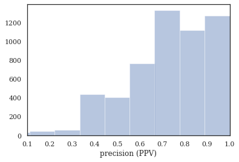
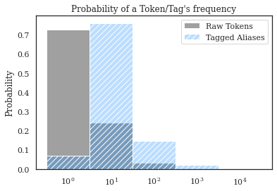
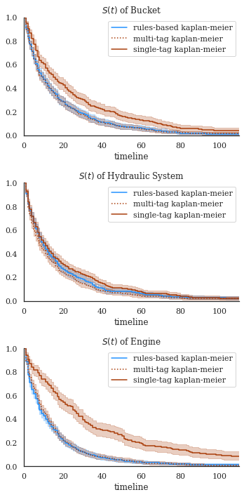
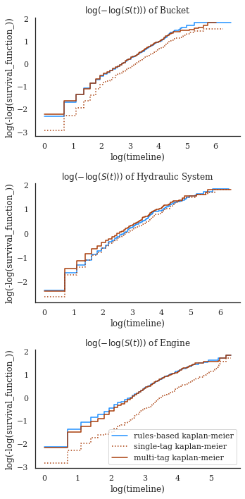

# Case Study: Excavator Survival Analysis

Mining Excavator dataset case study, as originally presented in Sexton et al. [@sexton2018benchmarking].


```python
from pathlib import Path
import numpy as np
import pandas as pd
import seaborn as sns
import matplotlib.pyplot as plt
%matplotlib inline

import nestor
from nestor import keyword as kex
import nestor.datasets as dat
def set_style():
    """This sets reasonable defaults for a figure that will go in a paper"""
    sns.set_context("paper")
    sns.set(font='serif')
    sns.set_style("white", {
        "font.family": "serif",
        "font.serif": ["Times", "Palatino", "serif"]
    })
set_style()
```


```python
df = dat.load_excavators()
df.head()
```


<div>
<style scoped>
    .dataframe tbody tr th:only-of-type {
        vertical-align: middle;
    }

    .dataframe tbody tr th {
        vertical-align: top;
    }

    .dataframe thead th {
        text-align: right;
    }
</style>
<table border="1" class="dataframe">
  <thead>
    <tr style="text-align: right;">
      <th></th>
      <th>BscStartDate</th>
      <th>Asset</th>
      <th>OriginalShorttext</th>
      <th>PMType</th>
      <th>Cost</th>
    </tr>
    <tr>
      <th>ID</th>
      <th></th>
      <th></th>
      <th></th>
      <th></th>
      <th></th>
    </tr>
  </thead>
  <tbody>
    <tr>
      <th>0</th>
      <td>2004-07-01</td>
      <td>A</td>
      <td>BUCKET WON'T OPEN</td>
      <td>PM01</td>
      <td>183.05</td>
    </tr>
    <tr>
      <th>1</th>
      <td>2005-03-20</td>
      <td>A</td>
      <td>L/H BUCKET CYL LEAKING.</td>
      <td>PM01</td>
      <td>407.40</td>
    </tr>
    <tr>
      <th>2</th>
      <td>2006-05-05</td>
      <td>A</td>
      <td>SWAP BUCKET</td>
      <td>PM01</td>
      <td>0.00</td>
    </tr>
    <tr>
      <th>3</th>
      <td>2006-07-11</td>
      <td>A</td>
      <td>FIT BUCKET TOOTH</td>
      <td>PM01</td>
      <td>0.00</td>
    </tr>
    <tr>
      <th>4</th>
      <td>2006-11-10</td>
      <td>A</td>
      <td>REFIT BUCKET TOOTH</td>
      <td>PM01</td>
      <td>1157.27</td>
    </tr>
  </tbody>
</table>
</div>


```python
vocab = dat.load_vocab('excavators')
vocab
```


<div>
<style scoped>
    .dataframe tbody tr th:only-of-type {
        vertical-align: middle;
    }

    .dataframe tbody tr th {
        vertical-align: top;
    }

    .dataframe thead th {
        text-align: right;
    }
</style>
<table border="1" class="dataframe">
  <thead>
    <tr style="text-align: right;">
      <th></th>
      <th>NE</th>
      <th>alias</th>
      <th>notes</th>
      <th>score</th>
    </tr>
    <tr>
      <th>tokens</th>
      <th></th>
      <th></th>
      <th></th>
      <th></th>
    </tr>
  </thead>
  <tbody>
    <tr>
      <th>replace</th>
      <td>S</td>
      <td>replace</td>
      <td>NaN</td>
      <td>0.033502</td>
    </tr>
    <tr>
      <th>bucket</th>
      <td>I</td>
      <td>bucket</td>
      <td>NaN</td>
      <td>0.018969</td>
    </tr>
    <tr>
      <th>repair</th>
      <td>S</td>
      <td>repair</td>
      <td>NaN</td>
      <td>0.017499</td>
    </tr>
    <tr>
      <th>grease</th>
      <td>I</td>
      <td>grease</td>
      <td>NaN</td>
      <td>0.017377</td>
    </tr>
    <tr>
      <th>leak</th>
      <td>P</td>
      <td>leak</td>
      <td>NaN</td>
      <td>0.016591</td>
    </tr>
    <tr>
      <th>...</th>
      <td>...</td>
      <td>...</td>
      <td>...</td>
      <td>...</td>
    </tr>
    <tr>
      <th>1boily 19</th>
      <td>NaN</td>
      <td>NaN</td>
      <td>NaN</td>
      <td>0.000046</td>
    </tr>
    <tr>
      <th>shd 1fitter</th>
      <td>NaN</td>
      <td>NaN</td>
      <td>NaN</td>
      <td>0.000046</td>
    </tr>
    <tr>
      <th>19 01</th>
      <td>NaN</td>
      <td>NaN</td>
      <td>NaN</td>
      <td>0.000046</td>
    </tr>
    <tr>
      <th>01 10</th>
      <td>NaN</td>
      <td>NaN</td>
      <td>NaN</td>
      <td>0.000046</td>
    </tr>
    <tr>
      <th>1fitter 1boily</th>
      <td>NaN</td>
      <td>NaN</td>
      <td>NaN</td>
      <td>0.000046</td>
    </tr>
  </tbody>
</table>
<p>6767 rows × 4 columns</p>
</div>


## Knowledge Extraction


We already have vocabulary and data, so let's merge them to structure our data to a more useful format. 

### scikit-learn's `Pipeline`

Convenient way to use [`TagExtractor`](nestor.keyword.TagExtractor) to output a more usable format. Let's use the multi-index `binary` format for now. Other options include:
- list-of-tokens `multilabel`
- NER-trainer `iob`.  


```python
# merge and cleanse NLP-containing columns of the data
from sklearn.pipeline import Pipeline

pipe = Pipeline([
    ('clean_combine', kex.NLPSelect(columns=["OriginalShorttext"])),
    ('tag', kex.TagExtractor(
        thesaurus=vocab, # load up pre-trained vocab file from [@sexton2018benchmarking]
        group_untagged=True,  # merge untagged tokens into a misc. `_untagged` label
        filter_types=None,  # keep all tag types
        ngram_range=(1,2),  # this vocab file includes compound tags, so make sure we find them
        verbose=True,  # report how much coverage our vocab file got on proposed tags (tokens)
        output_type='binary', # could use `multilabel` or `iob` as well
    )),
])
tags = pipe.fit_transform(df)

tags.sum().sort_values(ascending=False)
```

    /home/tbsexton/miniconda3/envs/nestor-docs/lib/python3.9/site-packages/pandas/core/indexing.py:670: SettingWithCopyWarning: 
    A value is trying to be set on a copy of a slice from a DataFrame
    
    See the caveats in the documentation: https://pandas.pydata.org/pandas-docs/stable/user_guide/indexing.html#returning-a-view-versus-a-copy
      iloc._setitem_with_indexer(indexer, value)
    100%|█████████████████████████████████████████████| 8/8 [00:02<00:00,  3.93it/s]

    Complete Docs: 1402, or 25.56%
    Tag completeness: 0.72 +/- 0.21
    Empty Docs: 47, or 0.86%


    


    NA  _untagged           8006.0
    S   replace             1364.0
    P   leak                 748.0
    I   engine               603.0
    S   repair               584.0
                             ...  
    SI  replace battery        1.0
        replace clamp          1.0
    PI  ring leak              1.0
    I   step_handrail          1.0
        windscreen_wiper       1.0
    Length: 1011, dtype: float64


We can also access the trained steps in the pipeline to make use of convenience functions. 


```python
tagger = pipe.named_steps['tag']
tags_read = tagger.tags_as_lists

relation_df = tags.loc[:, ['PI', 'SI']]
tag_df = tags.loc[:, ['I', 'P', 'S', 'U', 'X', 'NA']]    
```

### Quality of Extracted Keywords

It's 


```python
nbins = int(np.percentile(tag_df.sum(axis=1), 90))
print(f'Docs have at most {nbins} tokens (90th percentile)')
```

    Docs have at most 9 tokens (90th percentile)


```python
tags_read.assign(text=df.OriginalShorttext).sample(10)
```


<div>
<style scoped>
    .dataframe tbody tr th:only-of-type {
        vertical-align: middle;
    }

    .dataframe tbody tr th {
        vertical-align: top;
    }

    .dataframe thead th {
        text-align: right;
    }
</style>
<table border="1" class="dataframe">
  <thead>
    <tr style="text-align: right;">
      <th></th>
      <th>I</th>
      <th>NA</th>
      <th>P</th>
      <th>PI</th>
      <th>S</th>
      <th>SI</th>
      <th>U</th>
      <th>X</th>
      <th>text</th>
    </tr>
  </thead>
  <tbody>
    <tr>
      <th>3530</th>
      <td>pressuriser, x15</td>
      <td></td>
      <td></td>
      <td></td>
      <td></td>
      <td></td>
      <td>working</td>
      <td></td>
      <td>X15 Pressuriser not working</td>
    </tr>
    <tr>
      <th>4746</th>
      <td>joystick</td>
      <td></td>
      <td>fell, stick</td>
      <td></td>
      <td></td>
      <td></td>
      <td></td>
      <td></td>
      <td>Joy stick fell apart</td>
    </tr>
    <tr>
      <th>3902</th>
      <td>pump</td>
      <td>_untagged</td>
      <td></td>
      <td></td>
      <td>mounting, reseal</td>
      <td>pump mounting</td>
      <td></td>
      <td></td>
      <td>RESEAL R/H PUMP MOUNTING.</td>
    </tr>
    <tr>
      <th>712</th>
      <td>cutting, engine, right_hand</td>
      <td>_untagged</td>
      <td></td>
      <td></td>
      <td></td>
      <td></td>
      <td></td>
      <td>keeps</td>
      <td>RH engine keeps cutting out</td>
    </tr>
    <tr>
      <th>2581</th>
      <td>accident, boom, cylinder, left_hand</td>
      <td></td>
      <td>damage</td>
      <td></td>
      <td>replace</td>
      <td></td>
      <td></td>
      <td>accident damage</td>
      <td>Replace accident damage LH Boom cyl</td>
    </tr>
    <tr>
      <th>3944</th>
      <td>boom, boom_control, cap, control, control_valv...</td>
      <td>_untagged</td>
      <td></td>
      <td></td>
      <td>replace</td>
      <td>replace boom</td>
      <td></td>
      <td></td>
      <td>Replace boom control valve cap seal</td>
    </tr>
    <tr>
      <th>3020</th>
      <td>grease, grease_line, line</td>
      <td></td>
      <td>blown</td>
      <td>blown grease</td>
      <td></td>
      <td></td>
      <td></td>
      <td></td>
      <td>BLOWN GREASE LINE</td>
    </tr>
    <tr>
      <th>3474</th>
      <td>engine, light</td>
      <td>_untagged</td>
      <td></td>
      <td></td>
      <td></td>
      <td></td>
      <td>come, stop</td>
      <td></td>
      <td>engine stop light has come on</td>
    </tr>
    <tr>
      <th>4567</th>
      <td>deck, extinguisher</td>
      <td></td>
      <td>missing</td>
      <td></td>
      <td></td>
      <td></td>
      <td></td>
      <td></td>
      <td>DCP Extinguisher missing top deck</td>
    </tr>
    <tr>
      <th>648</th>
      <td>engine, text</td>
      <td></td>
      <td>overheating</td>
      <td></td>
      <td></td>
      <td></td>
      <td></td>
      <td></td>
      <td>ENG OVERHEATING   SEE  TEXT</td>
    </tr>
  </tbody>
</table>
</div>


```python
# how many instances of each keyword class are there?
print('named entities: ')
print('I\tItem\nP\tProblem\nS\tSolution')
print('U\tUnknown\nX\tStop Word')
print('total tokens: ', vocab.NE.notna().sum())
print('total tags: ', vocab.groupby("NE").nunique().alias.sum())
vocab.groupby("NE").nunique()
```

    named entities: 
    I	Item
    P	Problem
    S	Solution
    U	Unknown
    X	Stop Word
    total tokens:  4060
    total tags:  1123


<div>
<style scoped>
    .dataframe tbody tr th:only-of-type {
        vertical-align: middle;
    }

    .dataframe tbody tr th {
        vertical-align: top;
    }

    .dataframe thead th {
        text-align: right;
    }
</style>
<table border="1" class="dataframe">
  <thead>
    <tr style="text-align: right;">
      <th></th>
      <th>alias</th>
      <th>notes</th>
      <th>score</th>
    </tr>
    <tr>
      <th>NE</th>
      <th></th>
      <th></th>
      <th></th>
    </tr>
  </thead>
  <tbody>
    <tr>
      <th>I</th>
      <td>633</td>
      <td>18</td>
      <td>1856</td>
    </tr>
    <tr>
      <th>P</th>
      <td>55</td>
      <td>5</td>
      <td>122</td>
    </tr>
    <tr>
      <th>PI</th>
      <td>150</td>
      <td>0</td>
      <td>672</td>
    </tr>
    <tr>
      <th>S</th>
      <td>44</td>
      <td>1</td>
      <td>97</td>
    </tr>
    <tr>
      <th>SI</th>
      <td>134</td>
      <td>0</td>
      <td>446</td>
    </tr>
    <tr>
      <th>U</th>
      <td>68</td>
      <td>56</td>
      <td>92</td>
    </tr>
    <tr>
      <th>X</th>
      <td>39</td>
      <td>0</td>
      <td>167</td>
    </tr>
  </tbody>
</table>
</div>


```python
# tag-completeness of work-orders?
tagger.report_completeness()

# with sns.axes_style('ticks') as style:
sns.distplot(tagger.tag_completeness.dropna(), 
             kde=False, bins=nbins, 
             kde_kws={'cut':0})
plt.xlim(0.1, 1.0)
plt.xlabel('precision (PPV)')
```

    Complete Docs: 1402, or 25.56%
    Tag completeness: 0.72 +/- 0.21
    Empty Docs: 47, or 0.86%


    /home/tbsexton/miniconda3/envs/nestor-docs/lib/python3.9/site-packages/seaborn/distributions.py:2619: FutureWarning: `distplot` is a deprecated function and will be removed in a future version. Please adapt your code to use either `displot` (a figure-level function with similar flexibility) or `histplot` (an axes-level function for histograms).
      warnings.warn(msg, FutureWarning)


    Text(0.5, 0, 'precision (PPV)')


    

    


### An Aside: Effectiveness of Tagging

What have we actually gained using the `TagExtractor`? 

The `vocab` file functions as a thesaurus, that has a default `alias` representing multiple disparate tokens. This means our resulting matrix dimensionality can be significantly reduced _using this domain knowledge_, which can improve model predictability, performance, applicability, etc.


```python
# original token string frequencies
cts = np.where(tagger.tfidf.todense()>0., 1, 0).sum(axis=0)
sns.histplot(
    cts, log_scale=True,
    stat='probability',discrete=True,
    label='Raw Tokens',
    color='grey'
)
# tag frequencies
sns.histplot(
    tag_df[['I', 'P', 'S']].sum(), log_scale=True,
    stat='probability', discrete=True,
    label='Tagged Aliases', 
    hatch='///', 
    color='dodgerblue',alpha=0.3,
)
plt.legend()
plt.title('Probability of a Token/Tag\'s frequency')
```


    Text(0.5, 1.0, "Probability of a Token/Tag's frequency")


    

    


The entire goal, in some sense, is for us to remove low-occurence, unimportant information from our data, and form concept conglomerates that allow more useful statistical inferences to be made. 
Tags mapped from `nestor-gui`, as the plot shows, have very few instances of 1x-occurrence concepts, compared to several thousand in the raw-tokens (this is by design, of course). 
Additionally, high occurence concepts that might have had misspellings or synonyms drastically inprove their average occurence rate. 

NOTE: This is _without_ artificial thresholding of minimum tag frequency. This would simply get reflected by "cutting off" the blue distribution below some threshold, not changing its shape overall. 


## Survival Analysis

What do we _do_ with tags? 

One way is to rely on their ability to normalize raw tokens into consistent aliases so that our estimates of rare-event statistics become possible. 

Say you wish to know the median-time-to-failure of an excavator subsystem (e.g. the engines in your fleet): this might help understand the frequency "engine expertise" is needed to plan for hiring or shift scheduls, etc. 

To get the raw text occurences into something more consistent for failure-time estimation, one might:

- make a rules-based algorithm that checks for known (a priori) pattern occurrences and categorizes/normalizes when matched (think: Regex matching)
- create aliases for raw tokens (e.g. using suggestions for "important" tokens from [TokenExtractor.thesaurus_template](nestor.keyword.TokenExtractor.thesaurus_template))

This was done in [@sexton2018benchmarking], and whe demonstrate the technique below. See the paper for further details!

### Rules-Based
From Hodkeiwiz et al, a rule-based method was used to estimate failure times for SA. Let's see their data: 


```python

df_clean = dat.load_excavators(cleaned=True)

df_clean['SuspSugg'] = pd.to_numeric(df_clean['SuspSugg'], errors='coerce')
df_clean.dropna(subset=['RunningTime', 'SuspSugg'], inplace=True)

df_clean.shape
```


    (5289, 16)


```python
df_clean.sort_values('BscStartDate').head(10)
```


<div>
<style scoped>
    .dataframe tbody tr th:only-of-type {
        vertical-align: middle;
    }

    .dataframe tbody tr th {
        vertical-align: top;
    }

    .dataframe thead th {
        text-align: right;
    }
</style>
<table border="1" class="dataframe">
  <thead>
    <tr style="text-align: right;">
      <th></th>
      <th>BscStartDate</th>
      <th>Asset</th>
      <th>OriginalShorttext</th>
      <th>PMType</th>
      <th>Cost</th>
      <th>RunningTime</th>
      <th>MajorSystem</th>
      <th>Part</th>
      <th>Action</th>
      <th>Variant</th>
      <th>FM</th>
      <th>Location</th>
      <th>Comments</th>
      <th>FuncLocation</th>
      <th>SuspSugg</th>
      <th>Rule</th>
    </tr>
    <tr>
      <th>ID</th>
      <th></th>
      <th></th>
      <th></th>
      <th></th>
      <th></th>
      <th></th>
      <th></th>
      <th></th>
      <th></th>
      <th></th>
      <th></th>
      <th></th>
      <th></th>
      <th></th>
      <th></th>
      <th></th>
    </tr>
  </thead>
  <tbody>
    <tr>
      <th>8</th>
      <td>2001-07-19</td>
      <td>B</td>
      <td>REPLACE LIP</td>
      <td>PM01</td>
      <td>1251.52</td>
      <td>7.0</td>
      <td>Bucket</td>
      <td>NaN</td>
      <td>Replace</td>
      <td>2V</td>
      <td>NaN</td>
      <td>NaN</td>
      <td>NaN</td>
      <td>Bucket</td>
      <td>0.0</td>
      <td>Rule_1_3_78_383_384</td>
    </tr>
    <tr>
      <th>1820</th>
      <td>2001-09-01</td>
      <td>B</td>
      <td>OIL LEAK L/H TRACK TENSIONER.</td>
      <td>PM01</td>
      <td>0.00</td>
      <td>3.0</td>
      <td>Hydraulic System</td>
      <td>Track</td>
      <td>Minor Maint</td>
      <td>18</td>
      <td>Leak</td>
      <td>Left</td>
      <td>NaN</td>
      <td>Power Train - Transmission</td>
      <td>0.0</td>
      <td>Rule_1_3_52_289_347_425_500</td>
    </tr>
    <tr>
      <th>1821</th>
      <td>2001-09-04</td>
      <td>B</td>
      <td>BAD SOS METAL IN OIL</td>
      <td>PM01</td>
      <td>0.00</td>
      <td>3.0</td>
      <td>Hydraulic System</td>
      <td>Slew Gearbox</td>
      <td>NaN</td>
      <td>NaN</td>
      <td>Contamination</td>
      <td>NaN</td>
      <td>NaN</td>
      <td>Sprocket/Drive Compartment Right</td>
      <td>0.0</td>
      <td>Rule_1_3_52_303_409</td>
    </tr>
    <tr>
      <th>5253</th>
      <td>2001-09-05</td>
      <td>B</td>
      <td>REPLACE AIRCONDITIONER BELTS</td>
      <td>PM01</td>
      <td>0.00</td>
      <td>23.0</td>
      <td>NaN</td>
      <td>Air Conditioning</td>
      <td>Replace</td>
      <td>2V</td>
      <td>NaN</td>
      <td>NaN</td>
      <td>NaN</td>
      <td>Air Conditioning System</td>
      <td>0.0</td>
      <td>Rule_1_3_224_227_383_384</td>
    </tr>
    <tr>
      <th>3701</th>
      <td>2001-09-05</td>
      <td>B</td>
      <td>REPLACE CLAMPS ON CLAM PIPES</td>
      <td>PM01</td>
      <td>0.00</td>
      <td>28.0</td>
      <td>NaN</td>
      <td>Mount</td>
      <td>Replace</td>
      <td>2V</td>
      <td>NaN</td>
      <td>NaN</td>
      <td>NaN</td>
      <td>Oil - Hydraulic</td>
      <td>0.0</td>
      <td>Rule_1_3_92_181_383_384</td>
    </tr>
    <tr>
      <th>1167</th>
      <td>2001-09-05</td>
      <td>B</td>
      <td>REPLACE RHS FAN BELT TENSIONER PULLEY</td>
      <td>PM01</td>
      <td>82.09</td>
      <td>0.0</td>
      <td>NaN</td>
      <td>Fan</td>
      <td>Minor Maint_Replace</td>
      <td>2V</td>
      <td>NaN</td>
      <td>Right</td>
      <td>NaN</td>
      <td>+Cooling System</td>
      <td>0.0</td>
      <td>Rule_1_3_125_347_383_384_509</td>
    </tr>
    <tr>
      <th>1168</th>
      <td>2001-09-11</td>
      <td>B</td>
      <td>replace fan belt</td>
      <td>PM01</td>
      <td>0.00</td>
      <td>6.0</td>
      <td>NaN</td>
      <td>Fan</td>
      <td>Replace</td>
      <td>2V</td>
      <td>NaN</td>
      <td>NaN</td>
      <td>NaN</td>
      <td>+Cooling System</td>
      <td>0.0</td>
      <td>Rule_1_3_125_383_384</td>
    </tr>
    <tr>
      <th>644</th>
      <td>2001-09-15</td>
      <td>B</td>
      <td>replace heads on lhs eng</td>
      <td>PM01</td>
      <td>0.00</td>
      <td>33.0</td>
      <td>Engine</td>
      <td>NaN</td>
      <td>Replace</td>
      <td>2V</td>
      <td>NaN</td>
      <td>Left</td>
      <td>NaN</td>
      <td>Engine Left Cylinder Heads</td>
      <td>0.0</td>
      <td>Rule_1_3_25_383_384_499</td>
    </tr>
    <tr>
      <th>4583</th>
      <td>2001-09-26</td>
      <td>B</td>
      <td>REPAIR CABIN DOOR FALLING OFF.</td>
      <td>PM01</td>
      <td>0.00</td>
      <td>27.0</td>
      <td>NaN</td>
      <td>Drivers Cabin</td>
      <td>Repair</td>
      <td>1</td>
      <td>NaN</td>
      <td>NaN</td>
      <td>NaN</td>
      <td>Operators Cabin</td>
      <td>0.0</td>
      <td>Rule_1_3_251_284_357</td>
    </tr>
    <tr>
      <th>9</th>
      <td>2001-10-01</td>
      <td>B</td>
      <td>rebuild lip #3</td>
      <td>PM01</td>
      <td>0.00</td>
      <td>74.0</td>
      <td>Bucket</td>
      <td>NaN</td>
      <td>Repair</td>
      <td>5</td>
      <td>NaN</td>
      <td>NaN</td>
      <td>NaN</td>
      <td>Bucket Clam (Lip)</td>
      <td>0.0</td>
      <td>Rule_1_3_78_362</td>
    </tr>
  </tbody>
</table>
</div>


We once again turn to the library [Lifelines](https://lifelines.readthedocs.io/en/latest/) as the work-horse for finding the Survival function (in this context, the probability at time $t$ since the previous MWO that a new MWO has **not** occured).


```python
from lifelines import WeibullFitter, ExponentialFitter, KaplanMeierFitter
mask = (df_clean.MajorSystem =='Bucket')
# mask=df_clean.index
def mask_to_ETclean(df_clean, mask, fill_null=1.):
    filter_df = df_clean.loc[mask]
    g = filter_df.sort_values('BscStartDate').groupby('Asset')
    T = g['BscStartDate'].transform(pd.Series.diff).dt.days
#     T.loc[(T<=0.)|(T.isna())] = fill_null
    E = (~filter_df['SuspSugg'].astype(bool)).astype(int)
    return T.loc[~((T<=0.)|(T.isna()))], E.loc[~((T<=0.)|(T.isna()))]

T, E = mask_to_ETclean(df_clean, mask)
wf = WeibullFitter()
wf.fit(T, E, label='Rule-Based Weibull')
print('{:.3f}'.format(wf.lambda_), '{:.3f}'.format(wf.rho_))
# wf.print_summary()
wf.hazard_.plot()
plt.title('weibull hazard function')
plt.xlim(0,110)

wf.survival_function_.plot()
plt.xlim(0,110)
plt.title('weibull survival function')
print(f'transform: β={wf.rho_:.2f}\tη={1/wf.lambda_:.2f}')
# wf._compute_standard_errors()
to_bounds = lambda row:'±'.join([f'{i:.2g}' for i in row])
wf.summary.iloc[:,:2].apply(to_bounds, 1)
```

    16.733 0.833
    transform: β=0.83	η=0.06


    lambda_       17±0.94
    rho_       0.83±0.026
    dtype: object


    

    


    

    


### Tag Based Comparison
We estimate the occurence of failures with tag occurrences. 


```python
import math


def to_precision(x,p):
    """
    returns a string representation of x formatted with a precision of p

    Based on the webkit javascript implementation taken from here:
    https://code.google.com/p/webkit-mirror/source/browse/JavaScriptCore/kjs/number_object.cpp
    """

    x = float(x)

    if x == 0.:
        return "0." + "0"*(p-1)

    out = []

    if x < 0:
        out.append("-")
        x = -x

    e = int(math.log10(x))
    tens = math.pow(10, e - p + 1)
    n = math.floor(x/tens)

    if n < math.pow(10, p - 1):
        e = e -1
        tens = math.pow(10, e - p+1)
        n = math.floor(x / tens)

    if abs((n + 1.) * tens - x) <= abs(n * tens -x):
        n = n + 1

    if n >= math.pow(10,p):
        n = n / 10.
        e = e + 1

    m = "%.*g" % (p, n)

    if e < -2 or e >= p:
        out.append(m[0])
        if p > 1:
            out.append(".")
            out.extend(m[1:p])
        out.append('e')
        if e > 0:
            out.append("+")
        out.append(str(e))
    elif e == (p -1):
        out.append(m)
    elif e >= 0:
        out.append(m[:e+1])
        if e+1 < len(m):
            out.append(".")
            out.extend(m[e+1:])
    else:
        out.append("0.")
        out.extend(["0"]*-(e+1))
        out.append(m)

    return "".join(out)

def query_experiment(name, df, df_clean, rule, tag, multi_tag, prnt=False):
    
    def mask_to_ETclean(df_clean, mask, fill_null=1.):
        filter_df = df_clean.loc[mask]
        g = filter_df.sort_values('BscStartDate').groupby('Asset')
        T = g['BscStartDate'].transform(pd.Series.diff).dt.days
        E = (~filter_df['SuspSugg'].astype(bool)).astype(int)
        return T.loc[~((T<=0.)|(T.isna()))], E.loc[~((T<=0.)|(T.isna()))]
    
    def mask_to_ETraw(df_clean, mask, fill_null=1.):
        filter_df = df_clean.loc[mask]
        g = filter_df.sort_values('BscStartDate').groupby('Asset')
        T = g['BscStartDate'].transform(pd.Series.diff).dt.days
        T_defined = (T>0.)|T.notna()
        T = T[T_defined]
        # assume censored when parts replaced (changeout)
        E = (~(tag_df.S.changeout>0)).astype(int)[mask]
        E = E[T_defined]
        return T.loc[~((T<=0.)|(T.isna()))], E.loc[~((T<=0.)|(T.isna()))]
    
    experiment = {
        'rules-based': {
            'query': rule,
            'func': mask_to_ETclean,
            'mask': (df_clean.MajorSystem == rule),
            'data': df_clean
        },
        'single-tag': {
            'query': tag,
            'func': mask_to_ETraw,
            'mask': tag_df.I[tag].sum(axis=1)>0,
            'data': df
        },
        'multi-tag': {
            'query': multi_tag,
            'func': mask_to_ETraw,
            'mask': tag_df.I[multi_tag].sum(axis=1)>0,
            'data': df
        }
    }
    results = {
       ('query', 'text/tag'): [],
#        ('Weibull Params', r'$\lambda$'): [],
       ('Weibull Params', r'$\beta$'): [],
       ('Weibull Params', '$\eta$'): [],
       ('MTTF', 'Weib.'): [],
       ('MTTF', 'K-M'): []
       }
    idx = []
    
    for key, info in experiment.items():
        idx += [key]
        results[('query','text/tag')] += [info['query']]
        if prnt:
            print('{}: {}'.format(key, info['query']))
        info['T'], info['E'] = info['func'](info['data'], info['mask'])
        wf = WeibullFitter()
        wf.fit(info['T'], info['E'], label=f'{key} weibull')
        
        to_bounds = lambda row:'$\pm$'.join([to_precision(row[0],2),
                                             to_precision(row[1],1)])
        
        params = wf.summary.T.iloc[:2]
        params['eta_'] = [1/params.lambda_['coef'],  # err. propagation
                          (params.lambda_['se(coef)']/params.lambda_['coef']**2)]
        params = params.T.apply(to_bounds, 1)
        
        results[('Weibull Params', r'$\eta$')] += [params['eta_']]
        results[('Weibull Params', r'$\beta$')] += [params['rho_']]
        if prnt:                                     
            print('\tWeibull Params:\n',
                  '\t\tη = {}\t'.format(params['eta_']), 
                  'β = {}'.format(params['rho_']))
        
        kmf = KaplanMeierFitter()
        kmf.fit(info["T"], event_observed=info['E'], label=f'{key} kaplan-meier')
        results[('MTTF','Weib.')] += [to_precision(wf.median_survival_time_,3)]
        results[('MTTF','K-M')] += [to_precision(kmf.median_survival_time_,3)]
        if prnt:
            print(f'\tMTTF: \n\t\tWeib \t'+to_precision(wf.median_survival_time_,3)+\
                   '\n\t\tKM \t'+to_precision(kmf.median_survival_time_,3))
        info['kmf'] = kmf
        info['wf'] = wf
    return experiment, pd.DataFrame(results, index=pd.Index(idx, name=name))
```


```python
bucket_exp, bucket_res = query_experiment('Bucket', df, df_clean,
                                          'Bucket',
                                          ['bucket'],
                                          ['bucket', 'tooth', 'lip', 'pin']);
```


```python
tags = ['hyd', 'hose', 'pump', 'compressor']
hyd_exp, hyd_res = query_experiment('Hydraulic System', df, df_clean,
                                    'Hydraulic System',
                                    ['hyd'],
                                    tags)
```


```python
eng_exp, eng_res = query_experiment('Engine', df, df_clean,
                                    'Engine',
                                    ['engine'],
                                    ['engine', 'filter', 'fan'])
```


```python
frames = [bucket_res, hyd_res, eng_res]
res = pd.concat(frames, keys = [i.index.name for i in frames],
               names=['Major System', 'method'])
res
```


<div>
<style scoped>
    .dataframe tbody tr th:only-of-type {
        vertical-align: middle;
    }

    .dataframe tbody tr th {
        vertical-align: top;
    }

    .dataframe thead tr th {
        text-align: left;
    }

    .dataframe thead tr:last-of-type th {
        text-align: right;
    }
</style>
<table border="1" class="dataframe">
  <thead>
    <tr>
      <th></th>
      <th></th>
      <th>query</th>
      <th colspan="2" halign="left">Weibull Params</th>
      <th colspan="2" halign="left">MTTF</th>
    </tr>
    <tr>
      <th></th>
      <th></th>
      <th>text/tag</th>
      <th>$\beta$</th>
      <th>$\eta$</th>
      <th>Weib.</th>
      <th>K-M</th>
    </tr>
    <tr>
      <th>Major System</th>
      <th>method</th>
      <th></th>
      <th></th>
      <th></th>
      <th></th>
      <th></th>
    </tr>
  </thead>
  <tbody>
    <tr>
      <th rowspan="3" valign="top">Bucket</th>
      <th>rules-based</th>
      <td>Bucket</td>
      <td>0.83$\pm$0.03</td>
      <td>0.060$\pm$3e-3</td>
      <td>10.8</td>
      <td>9.00</td>
    </tr>
    <tr>
      <th>single-tag</th>
      <td>[bucket]</td>
      <td>0.83$\pm$0.03</td>
      <td>0.038$\pm$3e-3</td>
      <td>17.0</td>
      <td>15.0</td>
    </tr>
    <tr>
      <th>multi-tag</th>
      <td>[bucket, tooth, lip, pin]</td>
      <td>0.82$\pm$0.02</td>
      <td>0.060$\pm$3e-3</td>
      <td>10.6</td>
      <td>9.00</td>
    </tr>
    <tr>
      <th rowspan="3" valign="top">Hydraulic System</th>
      <th>rules-based</th>
      <td>Hydraulic System</td>
      <td>0.86$\pm$0.02</td>
      <td>0.072$\pm$3e-3</td>
      <td>9.02</td>
      <td>8.00</td>
    </tr>
    <tr>
      <th>single-tag</th>
      <td>[hyd]</td>
      <td>0.89$\pm$0.04</td>
      <td>0.027$\pm$2e-3</td>
      <td>24.3</td>
      <td>25.0</td>
    </tr>
    <tr>
      <th>multi-tag</th>
      <td>[hyd, hose, pump, compressor]</td>
      <td>0.88$\pm$0.02</td>
      <td>0.068$\pm$3e-3</td>
      <td>9.71</td>
      <td>9.00</td>
    </tr>
    <tr>
      <th rowspan="3" valign="top">Engine</th>
      <th>rules-based</th>
      <td>Engine</td>
      <td>0.81$\pm$0.02</td>
      <td>0.059$\pm$3e-3</td>
      <td>10.8</td>
      <td>9.00</td>
    </tr>
    <tr>
      <th>single-tag</th>
      <td>[engine]</td>
      <td>0.80$\pm$0.03</td>
      <td>0.053$\pm$3e-3</td>
      <td>12.0</td>
      <td>10.0</td>
    </tr>
    <tr>
      <th>multi-tag</th>
      <td>[engine, filter, fan]</td>
      <td>0.81$\pm$0.02</td>
      <td>0.068$\pm$4e-3</td>
      <td>9.31</td>
      <td>8.00</td>
    </tr>
  </tbody>
</table>
</div>


```python

exp = [bucket_exp, eng_exp, hyd_exp]
f,axes = plt.subplots(nrows=3, figsize=(5,10))
for n, ax in enumerate(axes): 
    exp[n]['rules-based']['kmf'].plot(ax=ax, color='dodgerblue')
    exp[n]['multi-tag']['kmf'].plot(ax=ax, color='xkcd:rust', ls=':')
    exp[n]['single-tag']['kmf'].plot(ax=ax, color='xkcd:rust')
    
    ax.set_xlim(0,110)
    ax.set_ylim(0,1)
    ax.set_title(r"$S(t)$"+f" of {res.index.levels[0][n]}")
    sns.despine()
plt.tight_layout()
f.savefig('bkt_KMsurvival.png')   
```


    

    


This next one give you an idea of the differences better. using a log-transform. the tags under-estimate death rates a little in the 80-130 day range, probably because there's a failure mode not captured by the [bucket, lip, tooth] tags (because it's rare).


```python
f,axes = plt.subplots(nrows=3, figsize=(5,10))
for n, ax in enumerate(axes): 
    exp[n]['rules-based']['kmf'].plot_loglogs(ax=ax, c='dodgerblue')
    exp[n]['single-tag']['kmf'].plot_loglogs(ax=ax, c='xkcd:rust', ls=':')
    exp[n]['multi-tag']['kmf'].plot_loglogs(ax=ax, c='xkcd:rust')
    if n != 2:
        ax.legend_.remove()
#     ax.set_xlim(0,110)
#     ax.set_ylim(0,1)
    ax.set_title(r"$\log(-\log(S(t)))$"+f" of {res.index.levels[0][n]}")
    sns.despine()
plt.tight_layout()
f.savefig('bkt_logKMsurvival.png')
# kmf.plot_loglogs()
```


    

    

