Using the Nestor Dashboard
==========================

This tutorial discusses the usage of the Nestor Dashboard.
The Dashboard is intended to provide simple, yet insightful views into
the data contained in Maintenance Work Orders (MWOs). It is a set of visualizations
that are pivoted around various maintenance aspects, such as by *machine*, *technician*,
*problem*, and so on.
It derives its information from the raw MWOs themselves, as well as the tagged
knowledge that is output from the NIST Nestor Tagging Tool.
The Nestor Dashboard is visualised on a browser for ease of navigation and to
remove dependencies on operating systems or other installed software.

Starting the Dashboard Server
-----------------------------

1. Open a terminal window

:Linux:      ``Ctrl`` + ``Alt`` + ``T``
:Windows:    ``Windows`` + ``R`` -> Type 'cmd'
:Mac:        ``⌘`` + ``Space`` -> Type 'Terminal'

2. Launch the Dashboard Server by typing in ``nestor-dash``

|imageopenterminal|

3. This starts up a server for the visualization. Note that
   the address of the server is output on the terminal window.
   In this case, it is seen on the last line as``http://127.0.0.1:5000/``.
   Copy this address.

|imagestartdash|

4. Open a web browser, and Paste the address from the previous step.
   The application called **Nestor Visual Dashboard** should start up
   and you will see the initial welcome screen.

|imagedashwelcome|

Uploading Data Files
--------------------
**Note**: For the current version of the dashboard, visualization is limited to datasets containing "Machine Name" and "Maintenance Technician" entries. **Ensure these have been labeled for export in the tagging tool!**

1. To immediately start visualizing your data, you need to upload a
   **.csv** or **.h5** file that was output from the NIST Nestor Tagging Tool.
   To do so, click on the **Upload File** button. This brings up the
   page to upload a .csv or .h5 file. Click on **Choose File** and select a file.
   In this case, the file *MWOs_anon.h5* is selected.

|imageuploadpage|

   After the upload is complete, the Dashboard shows the list of currently
   uploaded files.

|imageuploadedfiles|

Viewing Visualizations on Nestor Dashboard
------------------------------------------

1. Now click on **Nestor Dashboard** at the top left corner. It brings up the
   overview page for all visualizations. Currently, there are 3 types incorporated.
   These are,
   - Bar Graph
   - Node-Link Diagram
   - Flow Diagram

|imagenestordash|

2. **Bar Chart**: This helps to quickly visualize the relative counts of various factors.
   For example, in this dataset, the various *Solutions* (S), *Problems* (P) and *Items* (I)
   can be seen for *Machines*. It is seen here that for the machine *B2*, *replaced* is
   the most frequent solution and *alarm* is the most frequent problem. Similarly,
   *turret* is the major item of concern.

|imagebarmachine|

   To derive insights about other machines, click on the drop-down on the right side.

|imagebarmachinedropdown|

   Also, you can vary the amount of data being displayed by changing the *n_thres* slider.

|imagebarmachinethresh|

   Instead of viewing all Solutions, Problems and Items in a *sorted* manner, it is also
   possible to group them individually.

|imagebarmachinegrouped|

   It is also possible to view the bar chart for various technicians instead of machines
   by using the dropdown.

|imagebartechs|

   The raw data that these visualizations derive from, are also available.

|imagebardataframe|

3. **Node-Link Diagram**: The second type of visualization is the Node-Link diagram.
   It helps show the connections and the strength of the connections between various
   items, problems and solutions, as a Graph.

|imagenodelink|

  As with the other visualizations, it is easy to switch between Technicians, Machines,
  and control the thresholds for visualization. There are values that can be controlled
  for both the nodes themselves and the strengths of the links between them.

|imagenodelinkthresholds|

4. **Flow Diagram**: The Sankey Flow Diagram is another kind of visualization that helps to
  see the category-wise connections. Simultaneously, it is also possible to see the
  severity of the category itself, such as a solution action or the item involved. The strength
  of the relations are proportional to the width of the line connecting the entities at either
  end.

|imageflowdiagrammachine|

  The weighting methods for the flow diagram can be varied between *cosine* and *count* based weights.

|imageflowdiagramweights|

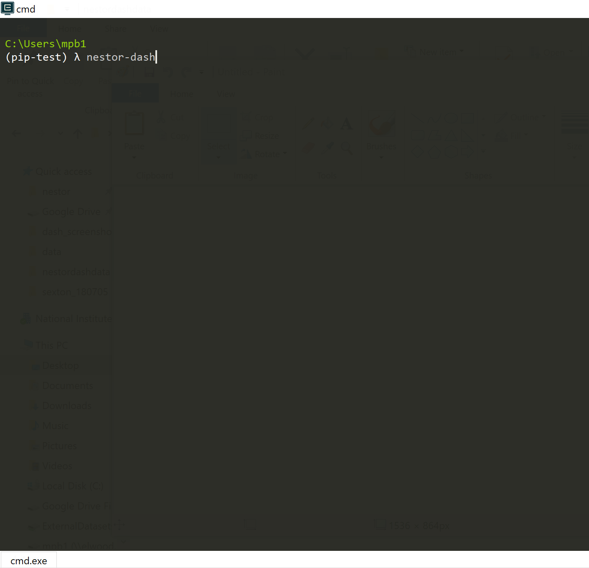
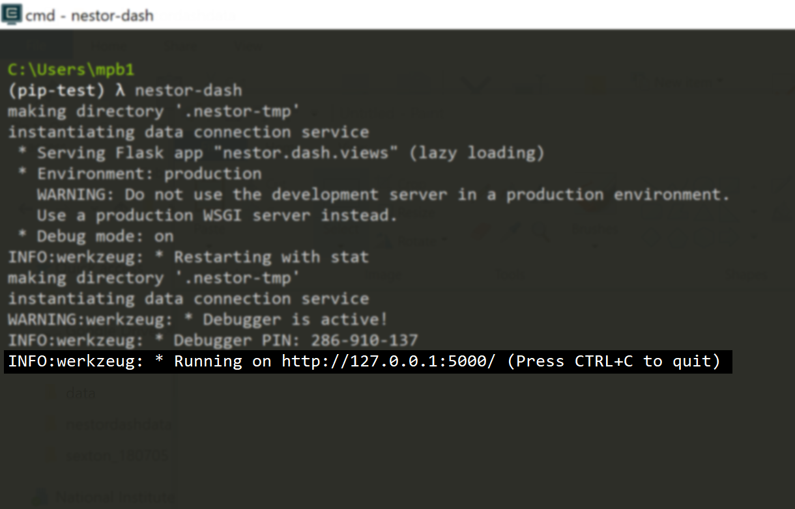
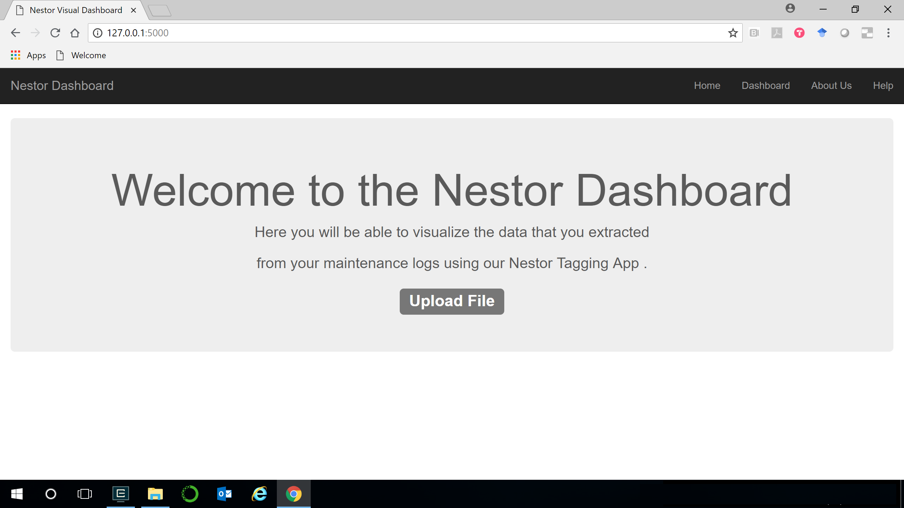
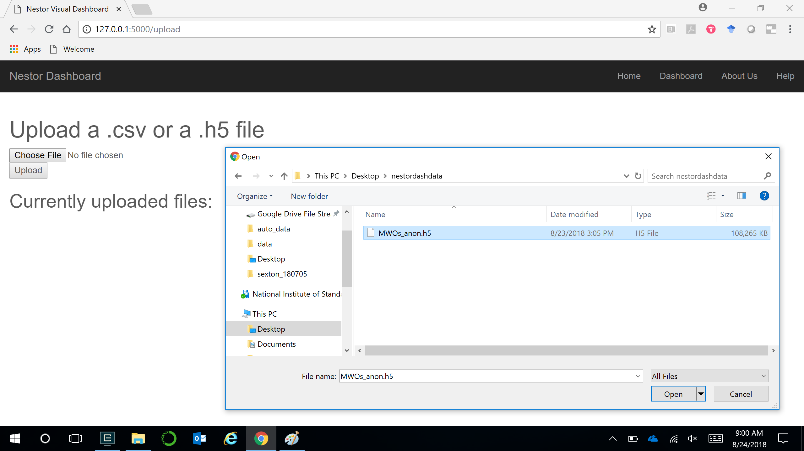
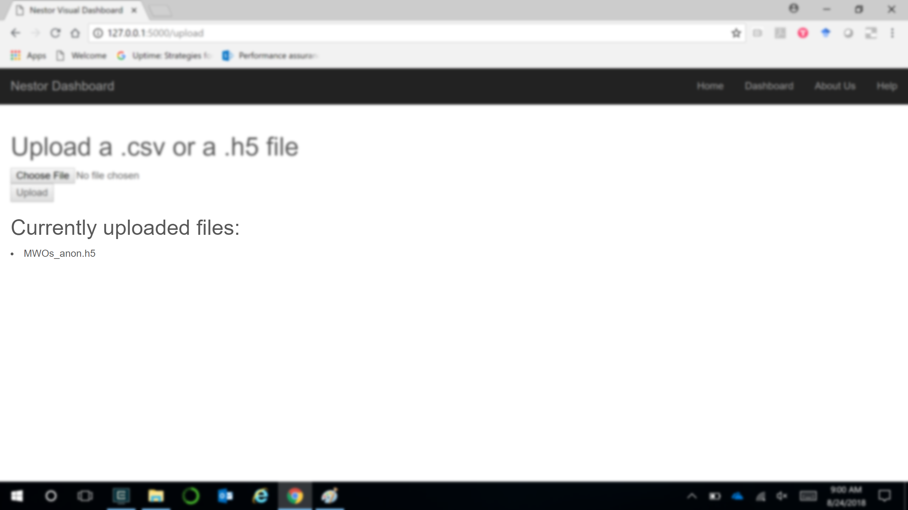
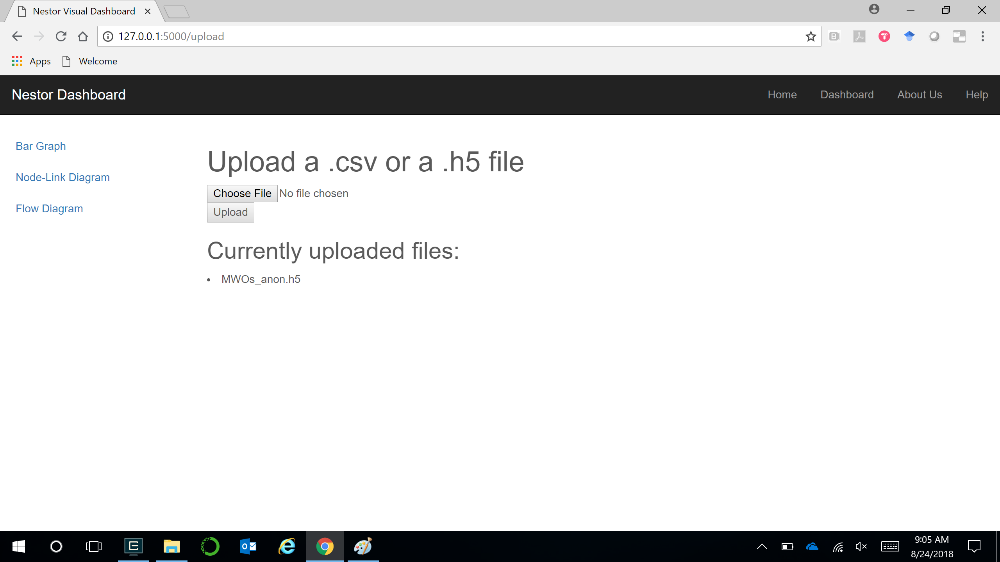
.. |imagebarmachine| image:: dash_images/dash_09.png
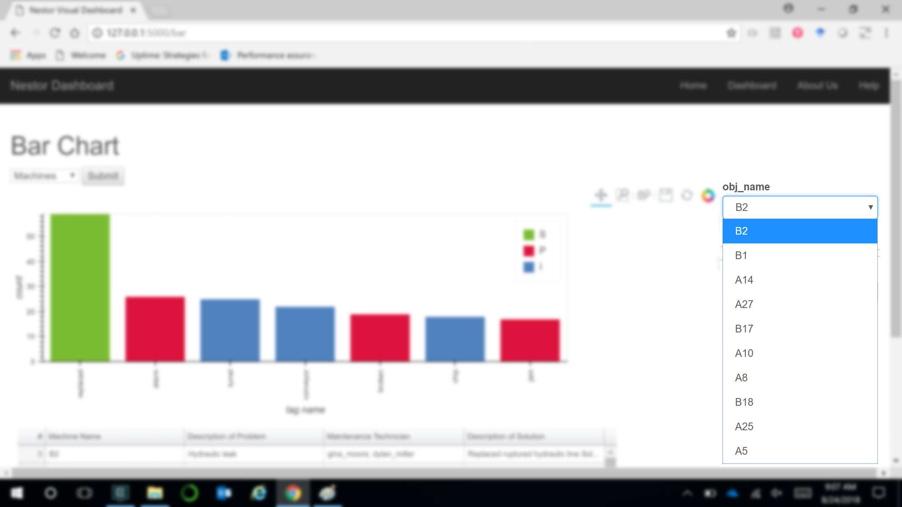
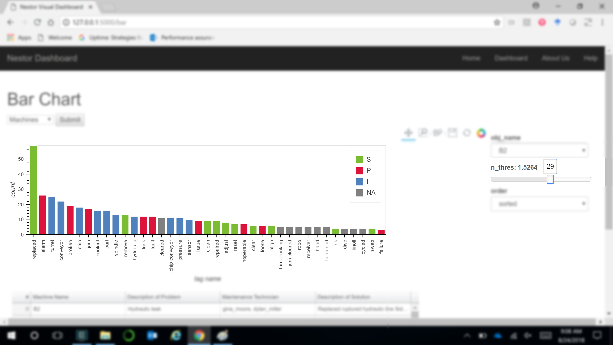
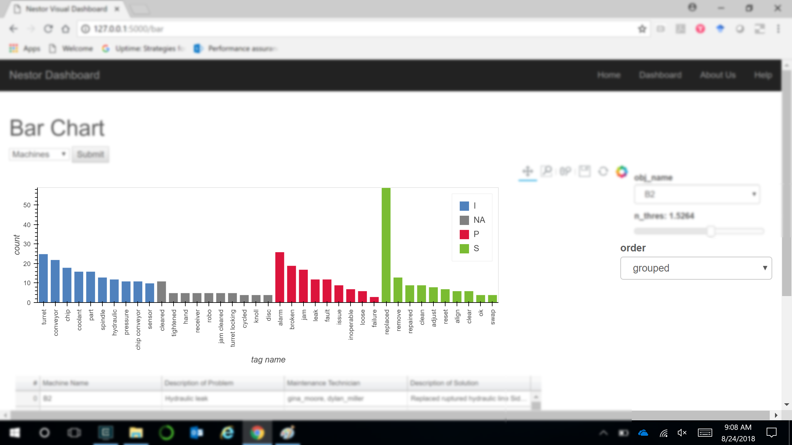
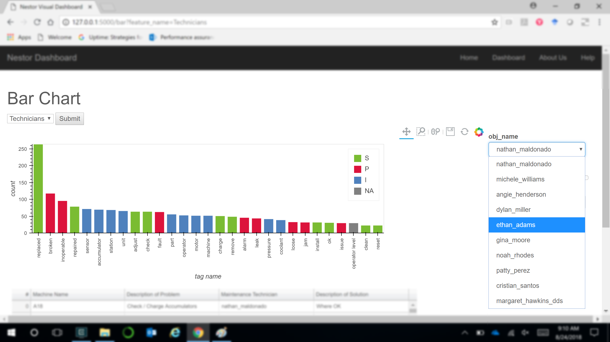
.. |imagebardataframe| image:: dash_images/dash_17.png
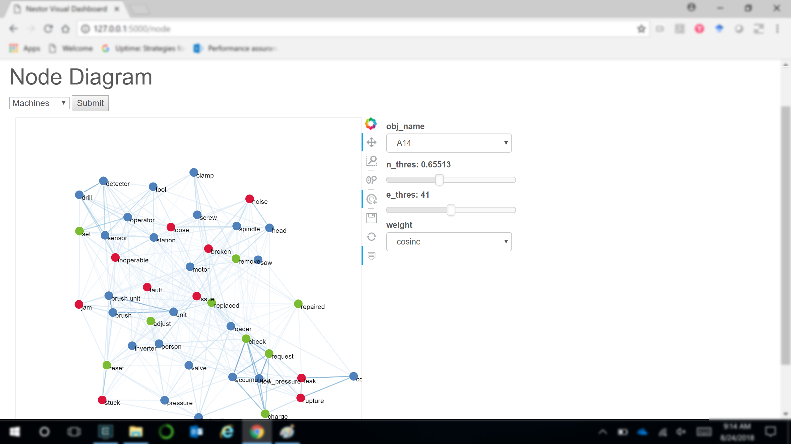
.. |imagenodelinkthresholds| image:: dash_images/dash_21.png
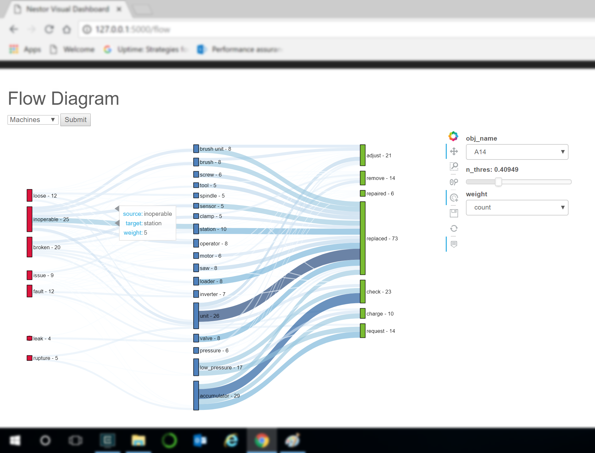
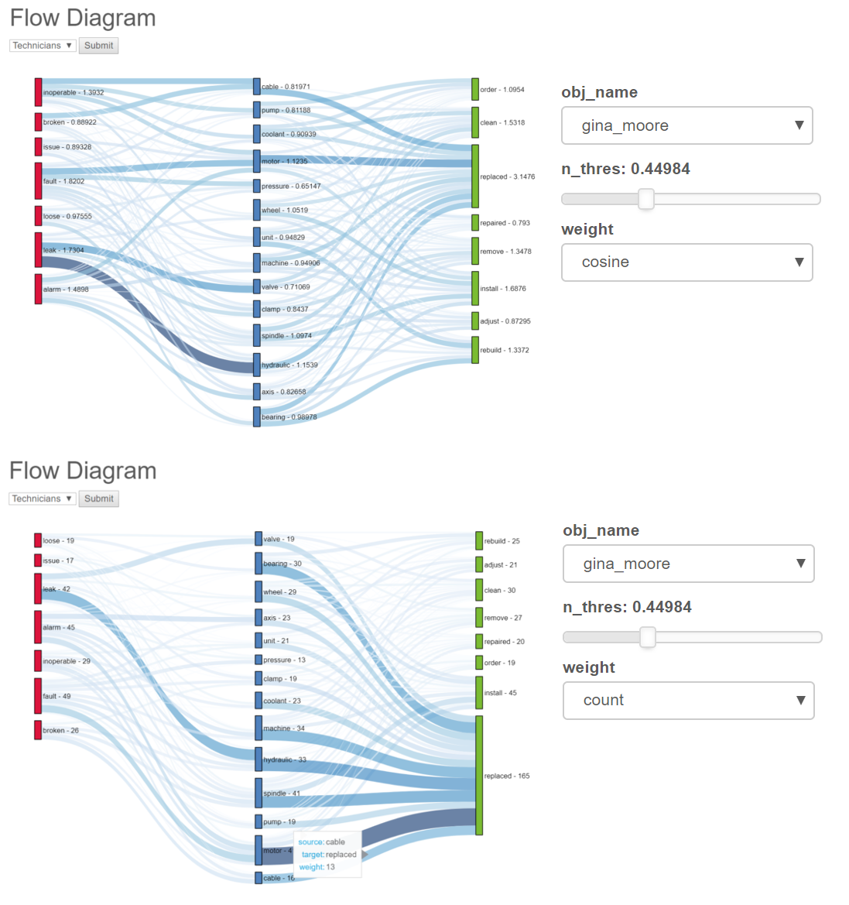

