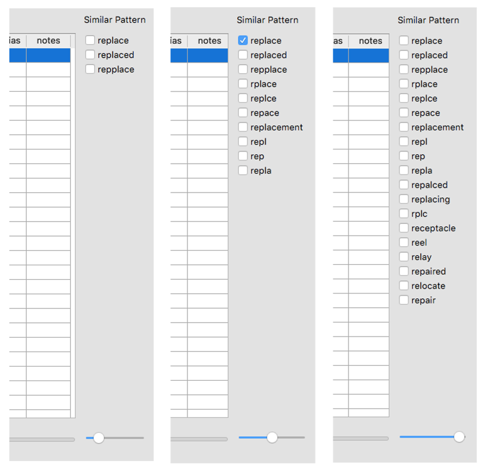

Using the Tagging Tool
======================

This section will walk through the steps for using the tagging tool
application.

Start the Application
---------------------

1.  Open a terminal window

Linux

:   `Ctrl` + `Alt` + `T`

Windows

:   `Windows` + `R` -\> Type \'cmd\'

Mac

:   `⌘` + `Space` -\> Type \'Terminal\'

2.  Launch the app by typing in `nestor-gui`
3.  The application should open as seen below:

4.  Open your .csv file with your MWOs. Please note, the file must be
    UTF-8 encoding. Included in the application, is a publicly available
    dataset. We will use this file as the example. The file,
    excavators.csv, is located in \<python
    path\>\\site-packages\\nestor\\datasets\\.

5.  If you are using the application for the first time, hit "Next"

If you are continuing from a previous session of tagging using Nestor,
load up the 1-gram and the N-gram files. Usually, they are automatically
loaded up using the same file-path as the .csv file. If the file-path
has changed, ensure that the correct 1-gram and N-gram files are
selected using the **Open** button.

6.  Select the column(s) that you would like to "tag." Check the check
    box. In this example, the column is "OriginalShorttext."

::: {#Dropdown Categories}
7.  There is also a drop-down to say what the column likely represents
    -this is for later analyses and future storage in a graph database.
    These categories in the drop-down come from [prior
    studies](https://www.nist.gov/publications/developing-maintenance-key-performance-indicators-maintenance-work-order-data)
    on Maintenance Key Performance Indicators (KPIs). These categories
    are used as the headers in the *.h5* binary files used to store the
    tagged data (See the Section: [Report tab](#report-tab)). A subset
    of these categories, *Machine Name* and *Maintenance Technician*,
    are used for the Nestor Dashboard. **Please note, the columns that
    are selected as headers do not need to be \"checked\" if these
    columns are not going to be tagged.**

    These categories will be used for constructing a graph database
    (**COMING SOON!**)

    The "OriginalShorttext" in this example matches \"Description of
    Problem\". Hit "Next".
:::

8.  The application window will open as seen below:

1 Gram Token tab
----------------

This subsection will describe the features of the application and goes
into detail on the "1 Gram Token" tab.

-   This window contains the following information:
    -   **tokens**: The token as seen in the corpus and ranked by
        [TF-IDF
        weighting](http://scikit-learn.org/stable/modules/feature_extraction.html#tfidf-term-weighting).
    -   **NE**: This is a "Named Entity." This column will track the
        classifications of the tokens, which will be explained in more
        detail later in the [Classification
        Section](#Classification Section).
    -   **alias**: This column tracks any aliases for tokens as made by
        the tool. These represent your new "tags.\"
    -   **notes**: This column tracks your notes for any tokens you have
        mapped to an alias.
-   Next, select a token to "tag." In this example, we use "replace."

-   The "similar pattern" field will display words similar to the token
    using an "edit-distance\"-based metric, via
    [fuzzywuzzy](https://github.com/seatgeek/fuzzywuzzy). Any term that
    is selected here will be given the same alias and classification as
    the original token. So in this example, if "replaced" is selected,
    it will be given the same alias, notes, and classification as
    "replace"

-   The "alias" field will allow a user to enter any alias they would
    like for a token. The field will auto suggest the "token" as-is as
    the initial alias, but the user has the ability to change it to any
    alias they desire.

::: {#Classification Section}
-   This field is where the user can classify the "token." The
    classifications provided are:
    -   **Item**: The objects directly relevant to the issue such as
        machine, resources, parts, etc. An example is a "pump" is always
        an item, however, "pumping" would not be an item.
    -   **Problem**: The problem that is occurring at an item. An
        example is "leak" is always a problem.
    -   **Solution**: The solution action taken on an item. An example
        is "replace" is always a solution.
    -   **Ambiguous (Unknown)**: Words that are unknown without more
        context. An example is "oil" as this can be an item or a
        solution. This is further described in the Section: [N Gram
        Token tab](#n-gram-token-tab)
    -   **Stop-word**: A word that does not matter for analysis. For
        example, "see" or "according" are stop-words.
:::

-   The "Notes" field allows users to enter notes about the
    token/classifications.

-   For each new session, regardless of whether using earlier tagged
    1-gram and N-gram files, each new word that is classified will be
    highlighted in a different color.

-   The "Update" button will update the interface with the user\'s
    selections.
-   The \"Save\" button will save the vocab files to a .csv file

-   The "Slider" will update the amount of similar terms that are
    displayed. As the slider moves right, more terms will display in
    \"Similar Pattern\".

-   For our example using \"replace\" from above, select all words that
    are similar, select \"Solution\", and then hit \"Update\".

N Gram Token tab
----------------

This subsection will describe the features of the application and goes
into detail on the "N Gram Token" tab.

-   The N Gram token tab will provide detail on common 2 grams tokens,
    ordered in TF-IDF ranking, for the corpus (e.g., "hydraulic leak" is
    a common 2 gram in some data sets). The 2 grams can also provide
    more context for the "Unknown" classifications from the above
    section. For example, "oil" is unknown until the user is provided
    more context.

-   When a user selects the N Gram Token tab, the window below is
    presented. Initially all the n-gram Named Entity classes are empty.

-   If the menu option for \"Auto-populate\" -\> \"From 1gram Vocab\" is
    chosen, the user is then presented with the \"Composition\" of the 2
    gram, which are composed of two 1 gram tokens. The other options are
    currently under development (**COMING SOON!**).

-   Each 1 gram is presented, with the classification ("type") and the
    synonyms (the other words that were linked with the Similar Pattern
    subwindow in the Section: [1 Gram Token tab](#gram-token-tab)). In
    this example, "oil" is an "unknown (U)" classification and has no
    other synonyms at this point; "leak" is a "problem (P)" and has
    synonyms: leak, leaking, leaks, leaky.

-   There are a number of classifications that a user can select for a 2
    grams. The user will have to classify any 2 grams that contain an
    "U" classification. Please note that some 2 grams will be
    pre-classified based on a ruleset as seen below:

-   **Problem Item**: This is a problem-item (or item-problem) pair. For
    example, "hydraulic" is an item and "leak" is a problem so
    "hydraulic leak" is a problem-item pair. The tool will pre-populate
    some problem-item pairs using the 1 grams that are classified as
    problems and items. The user will need to confirm these pairs are
    correct.
-   **Solution Item**: This is a solution-item (or item-solution) pair.
    For example, "hydraulic" is an item and "replace" is a solution so
    "replace hydraulic" is a solution-item pair. The tool will
    pre-populate some solution-item pairs using the 1 grams that are
    classified as solutions and items. The user will need to confirm
    these pairs are correct.
-   **Item**: This is for pairs of items that are de facto 1-grams. For
    example "grease" is an item, line is an "item", but a "grease\_line"
    is most likely its own "item\". The tool will pre-populate some
    items based on 1 grams that are both items. The user will need to
    confirm these pairs are correct. Please note that 2 gram items,
    since they are really being treated as 1-grams, must have an
    underscore (\_) in their alias, between the 2 individual items as
    seen below:

-   **Problem**: This is a problem that is a 2 gram. This will be left
    up to the user to classify as these will not be pre-populated using
    1 gram classifications. Please note that 2 gram problems, since they
    are being treated as 1-grams, must have an underscore (\_) in their
    alias, between the 2 individual problems.
-   **Solution**: This is a solution that is a 2 gram. This will be left
    up to the user to classify as these will not be pre-populated using
    1 gram classifications. Please note that 2 gram solutions, since
    they are really being treated as 1-grams, must have an underscore
    (\_) in their alias, between the 2 individual solutions.
-   **Ambigious (Unknown)**: This is an unknown 2 gram that needs more
    context. This will be left up to the user to classify as these will
    not be pre-populated using 1 gram classifications.
-   **Stop-word**: This is 2 gram stop-word. This will be pre-populated
    when a "solution" 1 gram is paired with a "problem" ' gram. The user
    can decide if any other 2 grams are not useful.

Report tab
----------

Once the user is done tagging their desired amount of tokens, they can
begin using the report tab.

-   Please make sure to hit the "update tag extraction" button before
    proceeding. This may take some time to compute. Please note on
    Windows computers, the application may state \"Not Responding\",
    however, the application is often still running.

-   The bottom graph will update. It explains the amount of tagging that
    has been completed. The distribution of documents (shown as a
    histogram) is calculated over the precision for each document (i.e.
    of the tokens found in a document, what fraction have a valid
    classification defined).

-   Summary statistics are also shown:
    -   **Tag PPV**: This is the Tag [Positive Predictive Value
        (PPV)](https://en.wikipedia.org/wiki/Positive_and_negative_predictive_values).
    -   **Complete Docs**: This is the number of MWOs that have all of
        the tokens completely tagged. In this example, 178 MWOs are
        completely tagged out of a possible 5485, which is 3.25%.
    -   **Empty Docs**: This is the number of MWOs that have zero tokens
        tagged. In this example, 1738 MWOs have no tokens tagged out of
        a possible 5485, which is 31.69%.

-   The "create new CSV" button will open a save window. A .csv file
    will be created with the original dataset and 7 new columns
    ("I","P","PI", "S","SI","U", and "X") , which contain the new tags
    from each category. Please note that "X" contains any stop words.

-   The "create a HDFS (binary)" button will open a save window and
    create a .h5 file. This file will be utilized later on to visualise
    the data on the Nestor Dashboard. It stores the tagged data with
    three keys - the original data (only columns with **updated
    headers** - as discussed in the step: [Dropdown
    Categories](#Dropdown Categories).), an occurrence matrix for tags
    versus documents, and an occurrence matrix for Problem-Items -
    Solution-Items versus documents.

