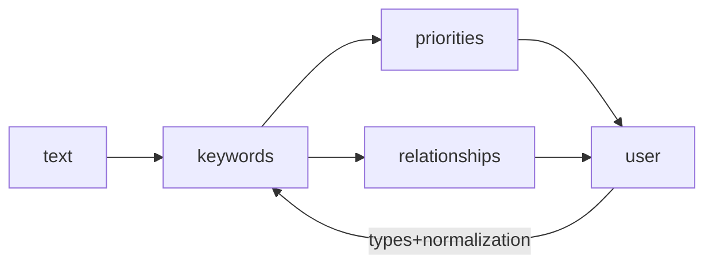

# Getting Started
## Workflow 

### Core Idea

Nestor starts out with a dataset of records with certain columns containing text.
This text is cleaned up and scanned for **keywords** that are statistically important to the corpus (e.g. using sum-tfidf; see [@horn2017exploring]). 

This gives an analyst an overview of terms that happen often or in special contexts, and must be dealt with as relevant (or not) to their analyses.
Especially important are the term **priorities**: as one travels further down the list, terms are deemed less important *to the machine*, giving the user a sense of how algorithms are "seeing" the corpus. 

However, in techical text, shorthands and jargon quickly develop. 
What started out being called "hydraulic" or "air conditioning unit" may eventually be called "hyd" or "ACU", obscuring statistical significance of both. 
These **relationships** can be determined through similarity in a number of ways: in our experience a useful similarity is to use variations on *Levenstein distance* to catch misspellings or abbreviations, but there are many others. 

Both the keyterms and their relationships can now be passed to a user for them to **type** as needed, structuring the now-named-entities as needed. 
Importantly, this is done in order of percieved importance, minimizing wasted time!

> *types* available are determined by`entities` property of  the `nestor.CFG` configuration object, which is set to use a maintenance-centric entity type system by default (`problem`, `item`, `solution`). Future releases will allow customization of this list!

### The "too-hot" problem

Often a keyword won't make sense out-of-context: if "hot" is important to an HVAC maintenance dataset, it is definitely important! 
But it may refer to a room being "too hot" (a problem), or perhaps "hot water" (just an object). 
This means the user can't know what to *type* the "hot" entity without more context. 

Nestor uses the idea of *derived types*, so that context-sensitive keywords can be built out of otherwise ambiguous blocks. 

> Derived types are governed by the `derived` property of `nestor.CFG`. 
> Rules for creating them from atomic types are defined by the `entity_rules_map` property. See [`nestor.settings`](nestor/settings.md) for more information.  

\bibliography

